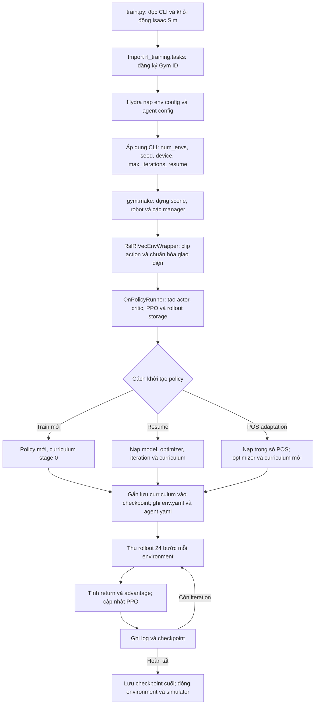

# Flat-VQR-Wheel-Yaw-POS — Luồng chạy và cấu hình hiện tại

Ngày đối chiếu: **05/10/2026**. Mã nguồn tại commit **`987e856`** (`sync for training`), trước khi thêm tài liệu này.

Tài liệu mô tả cấu hình mặc định có hiệu lực sau chuỗi `__post_init__`, luồng huấn luyện RSL-RL và các thay đổi cấu hình trong quá trình chạy. Các giá trị lấy từ mã nguồn hiện tại; một số snapshot run trong workspace được ghi riêng ở mục 15. Đây là mô tả cơ chế và mục tiêu huấn luyện, không phải kết luận rằng một checkpoint cụ thể đã đạt mọi mục tiêu.

## 1. Task học hành vi gì?

Task nhận **một lệnh tốc độ yaw** `yaw_rate_cmd`, đơn vị `rad/s`, và học hai hành vi bằng cùng một policy:

| Điều kiện của lệnh `c` | Hành vi được reward hướng tới |
| --- | --- |
| `abs(c) <= 0.1` | Hạ bánh, đứng trên bốn bánh, giữ tư thế mặc định, giảm yaw và vận tốc tịnh tiến, giữ vị trí sau khi tiếp đất |
| `c > 0.1` | Đỡ bằng `FL_WHEEL` và `HR_WHEEL`, nâng `FR_WHEEL` và `HL_WHEEL`, quay theo yaw dương bằng chuyển động lăn vi sai, giữ CoM gần đứng yên |

`FL/FR/HL/HR` lần lượt là trước trái, trước phải, sau trái, sau phải. Cặp bánh đỡ và cặp bánh nâng được cố định trong cấu hình POS. Policy vẫn điều khiển cả 12 khớp chân và cả 4 motor bánh.

Chuyển từ đứng bốn bánh sang quay, hoặc từ quay trở về đứng, là hành vi policy phải học từ observation và reward. Task POS không có FSM, lịch pose trung gian hay controller riêng thực hiện chuyển tư thế. Các tên `FOUR_STAND` và `POS` trong tài liệu chỉ diễn giải chế độ của lệnh.

Sampler huấn luyện và API điều khiển bên ngoài chỉ sinh lệnh không âm. Nếu tự ghi trực tiếp lệnh âm nhỏ vào buffer, mask reward vẫn coi `[-0.1, 0.1]` là trung tính; lệnh âm nhỏ hơn `-0.1` nằm ngoài miền hành vi POS được định nghĩa.

Nguồn: [cấu hình POS][cfg-pos], [command POS][cmd-pos], [mask reward][rew-pos].

## 2. Đăng ký task và chuỗi kế thừa

### 2.1. Gym registry

| Thành phần | Giá trị |
| --- | --- |
| Gym ID | `Flat-VQR-Wheel-Yaw-POS` |
| Environment entry point | `isaaclab.envs:ManagerBasedRLEnv` |
| `env_cfg_entry_point` | `...config.wheeled.vqr_wheel.yaw_env_pos_cfg:VQRWheelFlatEnvPOSCfg` |
| `rsl_rl_cfg_entry_point` | `...config.wheeled.vqr_wheel.agents.rsl_rl_ppo_cfg:VQRWheelYawFlatPOSPPORunnerCfg` |
| Gym environment checker | Tắt bằng `disable_env_checker=True` |

Registry POS hiện đăng ký agent RSL-RL. `Flat-VQR-Wheel-Yaw-POS-Transfer` và `Flat-VQR-Wheel-Yaw-FSM` là các Gym ID riêng, với config riêng.

### 2.2. Config environment

```text
isaaclab.envs.ManagerBasedRLEnvCfg
└── velocity_yaw_env_cfg.LocomotionVelocityRoughEnvCfg
    └── yaw_env_cfg.VQRWheelRoughEnvCfg
        └── yaw_env_cfg.VQRWheelFlatEnvCfg
            └── yaw_env_pos_cfg.VQRWheelFlatEnvPOSCfg
```

Chuỗi này dùng **`yaw_env_cfg.py`**, không dùng `flat_env_cfg.py` của task locomotion thông thường, dù có các class trùng tên.

| Lớp | Đóng góp chính |
| --- | --- |
| `LocomotionVelocityRoughEnvCfg` | Scene, observation policy/critic, events, simulation và termination nền |
| `VQRWheelRoughEnvCfg` trong `yaw_env_cfg.py` | Asset VQRWheel, thứ tự khớp, action scale cuối cùng, noise, 18 reward yaw nền, torso termination, cấu hình reset và DR |
| `VQRWheelFlatEnvCfg` trong `yaw_env_cfg.py` | Chuyển terrain thành plane, bỏ terrain generator và `height_scanner` |
| `VQRWheelFlatEnvPOSCfg` | Thay command/reward/curriculum bằng bản POS; giảm noise tốc độ bánh; thay critic rolling kinematics; chốt miền command không âm |

### 2.3. Config runner

```text
RslRlOnPolicyRunnerCfg
└── VQRWheelRoughPPORunnerCfg
    └── VQRWheelFlatPPORunnerCfg
        └── VQRWheelYawFlatPPORunnerCfg
            └── VQRWheelYawFlatPOSPPORunnerCfg
```

Giá trị cuối cùng là `max_iterations=30000`, `experiment_name="vqr_wheel_yaw_flat_pos"`, `resume=False`, `entropy_coef=0.0025`.

Nguồn: [registry][registry], [environment nền][cfg-base], [environment yaw][cfg-yaw], [runner][runner-cfg].

## 3. Luồng khởi tạo và huấn luyện tổng thể



Các bước cụ thể trong `train.py`:

1. `AppLauncher` chạy trước các import phụ thuộc Isaac Sim. Script kiểm tra `rsl-rl-lib >= 3.0.1`.
2. `@hydra_task_config(args_cli.task, args_cli.agent)` lấy config từ Gym registry. Agent entry point mặc định là `rsl_rl_cfg_entry_point`.
3. Cập nhật config bằng CLI; `env_cfg.seed` lấy từ `agent_cfg.seed`. Khi chạy distributed, device và seed được điều chỉnh theo `local_rank`.
4. `gym.make(..., cfg=env_cfg)` dựng `ManagerBasedRLEnv` với các manager cho observation, action, reward, command, event, termination và curriculum.
5. Wrapper truyền `clip_actions=100`; `OnPolicyRunner` được tạo từ `agent_cfg.to_dict()`.
6. Nếu resume, script nạp checkpoint bằng `runner.load(..., load_optimizer=True)`, xử lý std override nếu có, rồi phục hồi curriculum. Nếu adaptation, đi qua hàm nạp trọng số riêng.
7. Gắn `_install_yaw_curriculum_checkpointing` để mọi lần lưu checkpoint có `infos["yaw_curriculum"]`.
8. Ghi `params/env.yaml`, `params/agent.yaml`; gọi `runner.learn(..., init_at_random_ep_len=True)`.

Runner random hóa `episode_length_buf` ban đầu để các environment không cùng timeout. Bộ đếm grace của torso termination được quản lý riêng nên không phụ thuộc bộ đếm episode đã random hóa.

Nguồn: [train.py][train], [torso termination][terminations].

## 4. Scene, simulation và robot

### 4.1. Scene và thời gian

| Tham số | Giá trị mặc định có hiệu lực | Ý nghĩa |
| --- | --- | --- |
| `scene.num_envs` | `4096` | Số environment song song; CLI `--num_envs` có thể thay đổi |
| `scene.env_spacing` | `2.5 m` | Khoảng cách giữa các environment |
| `terrain_type` | `"plane"` | Mặt đất phẳng |
| `terrain_generator` | `None` | Không sinh rough terrain |
| `sim.dt` | `0.005 s` | Physics chạy ở `200 Hz` |
| `decimation` | `4` | Giữ một action qua 4 physics step |
| `step_dt` | `0.02 s` | Bước điều khiển/RL ở `50 Hz` |
| `episode_length_s` | `20.0 s` | Tối đa `1000` bước điều khiển cho episode đầy đủ |
| `sim.render_interval` | `4` | Render theo chu kỳ 4 physics step khi cần render |
| `gpu_collision_stack_size` | `2**27` | Bộ đệm collision PhysX |
| `gpu_max_rigid_patch_count` | `2**19` | Bộ đệm rigid contact patch |
| Solver position/velocity iterations | `4 / 1` | Có cấu hình cả ở simulation và articulation |

Vật liệu ground dùng `friction_combine_mode="multiply"`, `restitution_combine_mode="multiply"`; `static_friction=1.0`, `dynamic_friction=1.0`, `restitution=1.0`. Vật liệu robot được random hóa riêng tại startup.

### 4.2. Robot và tư thế mặc định

Robot lấy từ `VQRWHEEL_CFG`, prim path `"{ENV_REGEX_NS}/Robot"`, base link `TORSO`. USD path được ghép từ `ISAACLAB_ASSETS_DATA_DIR` với `VQRWheel/VQRWheel_usd/VQRWheel.usd`.

| Thuộc tính | Giá trị |
| --- | --- |
| Vị trí root ban đầu | `(0, 0, 0.45) m`, tương đối với origin environment |
| HipX mặc định | `0.0 rad` |
| HipY mặc định | `-0.65 rad` |
| Knee mặc định | `1.3 rad` |
| Joint velocity mặc định | `0.0 rad/s` |
| Bán kính bánh dùng trong reward/observation | `0.091 m` |
| Soft joint position limit factor | `0.9` |
| Gravity | Bật |
| Self collision | Tắt |
| Linear/angular damping của rigid body | `0.0 / 0.0` |
| Max depenetration velocity | `1.0 m/s` |

Root khởi tạo ở `0.45 m`; reward `base_height` hướng tới **`0.49 m`**. `MIN_BASE_HEIGHT=0.35 m` là ngưỡng penalty/certification, không phải một termination theo chiều cao trong task POS.

### 4.3. Actuator

| Nhóm | Khớp chân | Motor bánh |
| --- | --- | --- |
| Loại | `DelayedPDActuatorCfg` | `DelayedPDActuatorCfg` |
| Effort limit khai báo | `60 Nm` mỗi khớp | `20 Nm` mỗi bánh |
| Velocity limit khai báo | `14.66 rad/s` | `58.90 rad/s` |
| Stiffness | `80.0` | `0.0` |
| Damping | HipX `1.524`; HipY `1.431`; Knee `0.859` | `0.6` |
| Friction | `0.0` | `0.0` |
| Armature | `0.0` | `0.0025` |
| Delay | `min_delay=2`, `max_delay=8` | `min_delay=2`, `max_delay=8` |

Delay tính theo các lần actuator được cập nhật trong physics loop; với `sim.dt=0.005 s`, 2–8 physics step tương ứng khoảng `10–40 ms`. Gain có thể được random hóa khi reset theo DR stage. Effort/velocity limit ở bảng là tham số actuator khai báo, không phải miền của action policy.

### 4.4. Sensor

| Sensor | Cấu hình cuối cùng |
| --- | --- |
| `contact_forces` | Quét `Robot/.*`, history length `3`, `track_air_time=True`, update period `0.005 s` |
| `height_scanner` | `None` sau khi chuyển sang Flat |
| `height_scanner_base` | Vẫn tồn tại, gắn với `TORSO`; grid resolution `0.05`, size `(0.1, 0.1)`, offset z `20 m`, mesh `/World/ground` |

Policy/critic không có term `height_scan` đang hoạt động. Vì `height_scanner_base` vẫn tồn tại trong scene, không nên diễn giải cấu hình Flat là đã bỏ toàn bộ ray-caster sensor.

Nguồn: [scene và simulation][cfg-base], [ghi đè yaw/flat][cfg-yaw], [asset VQRWheel][asset].

## 5. Luồng một bước điều khiển và reset

Thứ tự dưới đây đã được đối chiếu với implementation `ManagerBasedRLEnv` của Isaac Lab cài trong workspace:

```text
Observation hiện tại o_t
  → Actor sinh action a_t
  → RSL-RL wrapper clip raw action vào [-100, 100]
  → ActionManager tách joint_pos / joint_vel, scale + offset, clip target
  → Lặp 4 physics step:
      apply_action → write_data_to_sim → sim.step → scene.update
  → Tăng episode_length_buf và common_step_counter
  → TerminationManager tính terminated / time_out
  → RewardManager tính reward và cập nhật các accumulator POS
  → Nếu có environment kết thúc:
      CurriculumManager đọc số liệu episode trước khi xóa buffer
      → scene.reset → reset events
      → reset các manager và log episode
  → CommandManager.compute: giảm timer, resample nếu đến hạn
  → Chạy interval events nếu đến hạn
  → ObservationManager tạo o_(t+1)
  → Trả observation, reward, done và extras cho PPO
```

Hệ quả của thứ tự này:

- Reward của bước vừa thực hiện dùng command đang điều khiển action đó. Command mới được resample ở cuối bước sẽ xuất hiện trong observation kế tiếp.
- Khi episode kết thúc, observation trả về là trạng thái sau reset; reward và done vẫn thuộc bước vừa kết thúc.
- Curriculum được tính **trước** khi reward/command/termination manager xóa dữ liệu episode. Do đó các số liệu về support, lift, yaw, contact và certification còn sẵn để xét tăng stage.
- `done` ở wrapper là `terminated OR truncated`. Với cấu hình horizon kế thừa, timeout được đưa vào `extras["time_outs"]` để RSL-RL xử lý bootstrap.
- Reward mỗi bước được tích phân theo thời gian: `reward_step = step_dt * sum(weight_i * raw_term_i)`. Weight trong các bảng reward không phải reward nguyên vẹn của một bước.

Các accumulator riêng cho geometry/motion, tuổi active, tuổi contact và neutral anchor được dọn theo environment reset trong curriculum POS. Các reward có trạng thái tuổi/anchor còn phát hiện reset qua `episode_length_buf <= 1` để hỗ trợ playback khi tắt curriculum.

Nguồn task: [reward POS][rew-pos], [curriculum POS][curr-pos]. Vị trí dependency đã đối chiếu được ghi ở mục 16.

## 6. Command: phân phối huấn luyện và điều khiển ngoài

### 6.1. Sampler huấn luyện

| Thuộc tính | Giá trị |
| --- | --- |
| Class | `YawPosCommand`, kế thừa `YawRateCommand` |
| Command buffer | Tensor `(num_envs, 1)` |
| `resampling_time_range` | `(4.0, 6.0) s` |
| `yaw_rate_range` lúc train mới | `(0.0, 0.25) rad/s` |
| `deadband` | `0.1 rad/s` |
| `neutral_probability` | `0.30` |
| `external_control` | `False` |
| `debug_vis` | `False` |
| `use_ground_heading_rate` | `True` trong config POS |

Mỗi lần reset/resample, từng environment lấy:

```text
Với xác suất 30%: c = 0 chính xác.
Với xác suất 70%: c ~ Uniform(deadband, yaw_limit).
                 Sau đó clamp_min(deadband + 1e-6).
```

Ở yaw stage 0, command active nằm trên `0.1` và dưới giới hạn `0.25 rad/s`. Curriculum chỉ nâng giới hạn trên; tỷ lệ neutral và chu kỳ 4–6 giây giữ nguyên.

Hai lần resample liên tiếp có thể cho cùng chế độ. Sampler không ép luân phiên neutral/POS và không đợi robot hoàn thành chuyển tư thế mới đổi command.

### 6.2. API runtime

```python
command = env.unwrapped.command_manager.get_term("yaw_rate_cmd")
command.set_external_command(0.7)  # được clamp theo yaw_limit đang có hiệu lực
command.set_external_command(0.0)  # yêu cầu đứng bốn bánh
command.use_training_sampler()    # trả quyền cho sampler theo lịch
```

`set_external_command` nhận một giá trị chung hoặc tensor ứng với `env_ids`, kiểm tra số phần tử và giá trị hữu hạn, clamp về `[0, yaw_limit]`, rồi đưa mọi giá trị `<= deadband` về `0`. Sau lời gọi, `_external_control=True`, nên sampler sẽ không ghi đè command. API ghi vào cùng buffer mà policy, reward và command metric đọc.

### 6.3. Tốc độ yaw được đo như thế nào?

Reward và command metric POS dùng **tốc độ heading trên mặt phẳng đất**. Với `b = R(q) * (1, 0, 0)` là trục X thân trong world frame:

```text
b_dot = omega_world × b
heading_rate = (b_x * b_dot_y - b_y * b_dot_x) / (b_x² + b_y²)
valid = (b_x² + b_y²) > 1e-8
```

Khi trục X thân gần thẳng đứng, heading không xác định: hàm trả rate `0` và `valid=False`; tracking reward không cấp điểm cho fallback này. Với thân nghiêng, `heading_rate` có thể khác cả `root_ang_vel_b.z` lẫn `root_ang_vel_w.z`.

Observation `base_ang_vel` của actor vẫn là angular velocity trong body frame; đổi định nghĩa yaw trong reward không làm đổi layout observation.

Nguồn: [command POS][cmd-pos], [ground-heading kinematics][kin-pos].

## 7. Observation và action contract

### 7.1. Observation policy: 55 chiều

Các term được concatenate theo thứ tự sau. Khoảng chỉ số dùng quy ước Python, đầu bao gồm và cuối không bao gồm.

| Slice | Term | Chiều | Giá trị / scale | Noise trước clip và scale |
| --- | --- | --- | --- | --- |
| `[0:3]` | `base_ang_vel` | 3 | Angular velocity body frame; scale `0.25` | Uniform `[-0.4, 0.4] rad/s` |
| `[3:6]` | `projected_gravity` | 3 | Gravity chiếu vào body frame; scale `1.0` | Uniform `[-0.1, 0.1]` |
| `[6:7]` | `yaw_rate_cmd` | 1 | Lệnh scalar hiện tại, scale mặc định `1` | Không |
| `[7:23]` | `joint_pos` | 16 | Joint position trừ default; 4 vị trí bánh được đặt 0 trước noise | Uniform mỗi bước `[-0.02, 0.02] rad` + bias mỗi episode, mỗi chiều `[-0.1, 0.1] rad` |
| `[23:39]` | `joint_vel` | 16 | Joint velocity trừ default; scale `0.05` | 12 khớp chân `[-3, 3] rad/s`; 4 bánh `[-0.5, 0.5] rad/s` |
| `[39:55]` | `actions` | 16 | ActionManager action hiện tại, tức action của bước trước khi tạo quyết định kế tiếp | Không |

Policy có `enable_corruption=True`, `concatenate_terms=True`. Các term angular velocity, gravity, joint position, joint velocity và actions có clip `[-100, 100]` trước scale. Term command không khai báo clip riêng.

Pipeline xử lý observation là `hàm term → noise/bias → clip → scale → concatenate`. Ví dụ noise joint velocity sau scale là khoảng `±0.15` cho chân và `±0.025` cho bánh; noise angular velocity sau scale là khoảng `±0.1`.

`joint_pos_rel_without_wheel` giữ nguyên **16 kênh**, chỉ đặt các kênh vị trí bánh về 0. Với actor, các kênh này vẫn có thể khác 0 sau khi thêm noise/bias. Actor không nhận base linear velocity, base height, contact, CoM geometry hay clearance làm term riêng; những dữ liệu đó được cấp thêm cho critic.

### 7.2. Observation critic: 83 chiều

Critic có `enable_corruption=False`, `concatenate_terms=True`.

| Slice | Term | Chiều | Nội dung |
| --- | --- | --- | --- |
| `[0:3]` | `base_lin_vel` | 3 | Linear velocity body frame |
| `[3:4]` | `base_height` | 1 | Root height trừ ground origin z |
| `[4:7]` | `base_ang_vel` | 3 | Angular velocity body frame, scale `1.0` |
| `[7:10]` | `projected_gravity` | 3 | Gravity body frame |
| `[10:11]` | `yaw_rate_cmd` | 1 | Command scalar |
| `[11:27]` | `joint_pos` | 16 | Relative joint positions, vị trí bánh đặt 0 |
| `[27:43]` | `joint_vel` | 16 | Relative joint velocities, scale `1.0` |
| `[43:59]` | `actions` | 16 | Action vector |
| `[59:63]` | `wheel_normal_force` | 4 | `max(Fz, 0) / 100`, thứ tự `FL, FR, HL, HR` |
| `[63:67]` | `wheel_contact` | 4 | `norm(net_force_w) > 1 N` |
| `[67:71]` | `wheel_clearance` | 4 | `wheel_center_z - ground_z - 0.091` |
| `[71:73]` | `support_wheel_alignment` | 2 | Trị tuyệt đối dot product giữa trục axle bánh `FL/HR` và trục Y thân |
| `[73:75]` | `com_support_coordinate` | 2 | CoM toàn thân so với midpoint đoạn `FL → HR`: `[along, lateral]`, đơn vị m |
| `[75:83]` | `rolling_lateral_contact_velocity` | 8 | `[rolling residual, lateral velocity]` của từng bánh `FL, FR, HL, HR`; bằng 0 nếu không contact |

CoM toàn thân được tính bằng trung bình vị trí CoM các rigid body có trọng số mass. POS thay callable của term cuối bằng implementation trong `wheel_contact_kinematics.py`.

Policy chọn 16 joint theo `self.joint_names` được khai báo rõ. Trong critic, `joint_pos` và `joint_vel` vẫn dùng selector kế thừa `joint_names=".*"`, nên thứ tự bên trong phụ thuộc thứ tự joint được resolve từ articulation. Không nên tự suy ra rằng critic đã có cùng khai báo thứ tự joint tường minh như actor; khi nạp checkpoint cần giữ đúng contract thực tế.

### 7.3. Action: 16 chiều

| Chỉ số | Joint | Kiểu target | Scale cuối cùng |
| --- | --- | --- | --- |
| 0 | `FL_HipX_joint` | Position residual | `0.30` |
| 1 | `FL_HipY_joint` | Position residual | `0.60` |
| 2 | `FL_Knee_joint` | Position residual | `0.50` |
| 3 | `FR_HipX_joint` | Position residual | `0.30` |
| 4 | `FR_HipY_joint` | Position residual | `0.60` |
| 5 | `FR_Knee_joint` | Position residual | `0.50` |
| 6 | `HL_HipX_joint` | Position residual | `0.30` |
| 7 | `HL_HipY_joint` | Position residual | `0.60` |
| 8 | `HL_Knee_joint` | Position residual | `0.50` |
| 9 | `HR_HipX_joint` | Position residual | `0.30` |
| 10 | `HR_HipY_joint` | Position residual | `0.60` |
| 11 | `HR_Knee_joint` | Position residual | `0.50` |
| 12 | `FL_WHEEL` | Velocity | `5.0` |
| 13 | `FR_WHEEL` | Velocity | `5.0` |
| 14 | `HL_WHEEL` | Velocity | `5.0` |
| 15 | `HR_WHEEL` | Velocity | `5.0` |

Thứ tự action term là `joint_pos` rồi `joint_vel`; cả hai có `preserve_order=True`, `use_default_offset=True`. Công thức target trước actuator:

```text
a_raw = clamp(a_policy, -100, 100)              # RSL-RL wrapper
q_target = clamp(q_default + scale * a_raw, -100, 100)
qd_target_wheel = clamp(0 + 5.0 * a_raw, -100, 100)
```

Clip của action term được áp dụng **sau scale và offset**, vào target position/velocity. Không có quy định action policy phải nằm trong `[-1, 1]`. Ví dụ `a=1` ở HipY yêu cầu `-0.65+0.60=-0.05 rad`; `a=1` ở bánh yêu cầu `5 rad/s`.

Giá trị `joint_pos.scale=0.25` và `joint_vel.scale=20.0` ở phần khai báo `VQRWheelActionsCfg` bị ghi đè bởi `VQRWheelRoughEnvCfg.__post_init__`; bảng trên là giá trị cuối cùng.

Nguồn: [observation nền][cfg-base], [ghi đè observation/action][cfg-yaw], [POS noise][noise-pos], [hàm observation][observations], [contact kinematics][kin-contact].

## 8. Reward có hiệu lực: 29 term

POS kế thừa reward yaw nền, thay các callable/parameter cần thiết, thêm reward riêng và đặt `support_span_band=None`. Kết quả là **29 term**, không phải 18 term của `Flat-VQR-Wheel-Yaw`.

Trong các bảng dưới đây, “POS” nghĩa là chỉ hoạt động khi `c>0.1`; “neutral” nghĩa là `abs(c)<=0.1`. Các term “mọi chế độ” không được mask theo mode, dù một số penalty có giảm mức phạt theo command.

### 8.1. Reward/penalty riêng cho quay POS

| Term | Weight | Raw term và tham số quan trọng |
| --- | ---: | --- |
| `com_support` | `+3.0` | `1/(1+d/0.08)`, với `d` là khoảng cách CoM đến đường thẳng qua `FL/HR` trong world XY |
| `support_line` | `+1.0` | `exp(-(max(e_FL,e_HR)/0.20)^2)`; từng bánh phải gần đường heading-Y đi qua CoM; cần heading hợp lệ |
| `support_y_collapse` | `-0.25` | `(relu(0.45-separation_Y)/0.05)^2`; phạt hai bánh đỡ co lại theo heading-Y, không đặt giới hạn trên cho separation |
| `lift_clearance` | `+3.0` | Shaping có dấu theo tiến độ nâng `FR/HL`, target do clearance curriculum cập nhật; điểm dương được gate theo contact `FL/HR` |
| `com_inside_segment` | `+2.0` | `exp(-(outside_distance/0.05)^2)`; giảm điểm nếu hình chiếu CoM vượt hai đầu đoạn đỡ |
| `heading_support` | `+1.0` | `1-support_x_rms/0.27`; kéo cả hai bánh đỡ về gần đường heading-Y qua CoM |
| `body_angular_xy` | `-0.1` | `omega_world_x^2 + omega_world_y^2`; không giảm penalty theo command |
| `lifted_wheel_spin` | `-0.02` | Tổng `qd^2` của `FR/HL` nhân hệ số command relief |
| `signed_ground_participation` | `+2.0` | Giá trị nhỏ hơn trong hai tỷ lệ signed `measured/target`, clamp `[0,1]`; cần cả hai support contact, target và heading hợp lệ |
| `rolling_tracking` | `+2.0` | Kernel Cauchy của lỗi ground rolling chuẩn hóa lớn nhất trong hai bánh đỡ; không dùng gate motor speed để triệt dense reward |
| `active_com_stationary` | `+3.0` | `1/(1+(v_CoM_XY/0.05)^2)`; dùng vận tốc CoM toàn thân có trọng số mass |

`heading_support` có thể âm nếu lệch quá `0.27 m`. `lift_clearance` cũng có thể âm dù weight dương, để phạt việc chưa nâng bánh. Không được coi mọi term có weight dương là một bonus luôn không âm.

### 8.2. Reward riêng cho neutral

| Term | Weight | Raw term và tham số quan trọng |
| --- | ---: | --- |
| `neutral_landing_progress` | `+3.0` | `1-mean(lift_progress_FR, lift_progress_HL)`; target clearance đồng bộ với `lift_clearance` |
| `four_stand_pose` | `+2.0` | `exp(-mean((q_leg-q_default)^2)/0.25^2)` trên 12 khớp chân |
| `four_wheel_contact` | `+3.0` | `0.2*mean(contact_4) + 0.8*all_four_contact`; threshold `1 N` |
| `neutral_velocity` | `+3.0` | `exp(-norm(root_lin_vel_w.XY)^2/0.05^2)` |
| `neutral_position` | `+2.0` | Sau khi đã chốt anchor: `exp(-(root_XY_drift/0.05)^2)`; contact dwell `0.2 s` |

Chỉ nhận điểm hạ bánh chưa đủ để đứng yên: `neutral_velocity` trực tiếp giảm vận tốc, còn `neutral_position` thưởng giữ vị trí cố định sau tiếp đất.

### 8.3. Reward/penalty dùng ở nhiều chế độ

| Term | Weight | Phạm vi và nội dung |
| --- | ---: | --- |
| `base_height` | `+2.0` | Mọi chế độ; `1-Huber(abs(height-0.49)/0.10)`, đồng thời ghi minimum height episode |
| `low_base_height` | `-4.0` | Mọi chế độ; `relu(0.35-height)/0.10` |
| `downward_low_base_velocity` | `-8.0` | Mọi chế độ; `clamp(relu(0.35-height)/0.10, max=1) * relu(-vz)^2` |
| `balance` | `+2.0` | Mọi chế độ; `exp(-(roll_error^2+pitch_error^2)/0.25^2)`, nominal roll/pitch đều `0` |
| `gated_yaw_tracking` | `+8.0` | POS: support/clearance-gated heading tracking; neutral: zero-heading-rate tracking, công thức ở mục 9 |
| `lateral_slip` | `-2.0` | Mọi chế độ; tổng bình phương vận tốc theo local axle-Y của các bánh có contact |
| `rolling_slip` | `-0.5` | Mọi chế độ; tổng rolling residual bình phương trên bánh có contact, nhân command relief; POS thay implementation kinematics |
| `undesired_contact` | `-2.0` | Mọi chế độ; phạt body contact ngoài `TORSO` và ngoài các bánh; regex `^(?!(TORSO\|.*_WHEEL)$).*`, threshold `1 N` |
| `joint_limits` | `-0.5` | Mọi chế độ; vi phạm soft joint position limits của 12 khớp chân |
| `action_rate` | `-0.02` | Mọi chế độ; `sum((action-prev_action)^2)` trên cả 16 action |
| `joint_velocity` | `-0.001` | Mọi chế độ; `sum(qd_leg^2)` trên 12 khớp chân |
| `torque` | `-0.0001` | Mọi chế độ; `sum(applied_torque^2)` trên 16 khớp, command relief có floor `0.30` |
| `planar_velocity` | `-1.0` | Mọi chế độ; `sum(root_lin_vel_b.XY^2)` |

Huber trong `base_height` là `0.5*x^2` khi `x<=1`, và `x-0.5` khi `x>1`. Raw score có thể âm nếu sai số chiều cao lớn.

Term `lateral_slip` kế thừa vẫn dùng `body_lin_vel_w` rồi đổi về local frame. Term `rolling_slip` và critic contact kinematics POS dùng **`body_link_lin_vel_w` tại tâm hình học bánh** và angular velocity rigid body. Đây là hai đường implementation khác nhau đang tồn tại trong mã.

Nguồn: [reward config POS][cfg-pos], [reward config nền][cfg-yaw], [reward POS][rew-pos], [reward nền][rewards].

## 9. Các công thức reward/gate quan trọng

### 9.1. Support và tiến độ nâng bánh

Các mask contact cho reward POS dùng force hiện tại:

```text
contact_i = norm(net_forces_w_i) > 1.0
support = contact_FL * contact_HR                     # chỉ 0 hoặc 1
clearance_i = wheel_center_z_i - ground_z - 0.091
progress_i = clamp(clearance_i / target_clearance, 0, 1)
lift_mean = mean(progress_FR, progress_HL)
lift_min_for_curriculum = min(progress_FR, progress_HL) * support
```

Reward nâng bánh có shaping:

```text
signed_lift = 2 * lift_mean - 1
lift_reward_raw = min(signed_lift, 0)
                  + max(signed_lift, 0) * (0.25 + 0.75 * support)
```

Do đó chưa nâng bánh có thể bị phạt ngay trong POS; lấy đầy đủ điểm dương khi nâng vẫn cần cả hai bánh đỡ contact. Curriculum dùng **minimum progress** của hai bánh, không dùng riêng trung bình lift.

### 9.2. Heading tracking

```text
clearance_weight = 0.25 + 0.75 * lift_mean
POS score = support * clearance_weight
            * exp(-((heading_rate-c)/0.20)^2) * heading_valid
neutral score = exp(-(heading_rate/0.30)^2) * heading_valid
```

Gate floor `0.25` tạo tín hiệu tracking khi mới học nâng bánh. Neutral tracking không bị gate bởi contact/lift; các reward neutral khác chịu trách nhiệm thưởng tiếp đất và đứng bốn bánh.

Edge command để đánh giá curriculum là `c >= 0.80*yaw_limit`. Tracking tổng và tracking tại biên có accumulator riêng; neutral không được cộng vào thống kê tracking POS.

### 9.3. Vi sai theo chuyển động lăn trên mặt đất

Với mỗi support wheel `i`, định nghĩa:

```text
axle_i = R(q_wheel_i) * local_Y
tangent_i = normalize(axle_i × world_Z)
r_i = wheel_center_i.XY - whole_body_CoM.XY
desired_velocity_i = c * (-r_i.y, r_i.x, 0)
target_i = dot(desired_velocity_i, tangent_i)
measured_i = dot(body_link_lin_vel_w_i, tangent_i)
scale_i = max(0.25*abs(target_i), 0.05 m/s)
normalized_error_i = (measured_i-target_i)/scale_i
rolling_tracking_raw = 1/(1+max_i(normalized_error_i^2))
```

Điểm rolling tracking được giữ khi hai target hợp lệ, heading hợp lệ và cả hai support contact; ngoài POS điểm bằng 0. Target gần 0 (`abs(target)<=1e-4`) không được coi là hợp lệ cho chứng nhận vi sai.

Quy ước dấu motor không được giả định trước. Đổi hướng axle sẽ đổi dấu cả target và measured, giữ nguyên lỗi tracking. `signed_ground_participation` dùng `min(clamp(measured_i/target_i, 0, 1))` để giảm điểm khi một bánh chạy sai chiều hoặc không tham gia đủ.

Raw `rolling_tracking` hiện tại là **Cauchy của lỗi lớn nhất**, không phải pseudo-Huber. Tên của các thử nghiệm/tài liệu lịch sử không thay thế công thức trong source hiện tại.

### 9.4. Rolling residual và command relief

```text
rolling_residual_i = dot(v_wheel_center_i, tangent_i)
                     - 0.091 * dot(omega_wheel_world_i, axle_i)
lateral_velocity_i = dot(v_wheel_center_i, axle_i)
```

Angular velocity ở đây là rigid-body angular velocity, bao gồm spin của bánh và chuyển động từ chân. Local axle-Y không đổi theo pha quay bánh, nên các phép chiếu này không phụ thuộc local-X đang quay theo bánh.

`rolling_slip` giữ weight `-0.5`, cùng thứ tự bốn bánh và contact threshold nền. Chỉ callable tính residual được thay bằng bản POS.

Hệ số giảm penalty theo command:

```text
relief(c, floor) = max(1-clamp(abs(c)/1.0, 0, 1), floor)
rolling_slip và lifted_wheel_spin: floor = 0
torque:                          floor = 0.30
```

Khi `c>=1 rad/s`, penalty rolling slip và lifted-wheel spin bị giảm về 0; torque vẫn còn ít nhất 30% mức phạt. Dense rolling tracking và điều kiện residual trong certification vẫn tồn tại, nên certification không mất kiểm tra residual ở các yaw stage cao.

### 9.5. Anchor giữ vị trí neutral

1. Trong neutral, tích lũy thời gian khi cả 4 bánh cùng contact; mất contact làm contact-age về 0.
2. Khi đủ `0.2 s`, nếu chưa có anchor thì chốt **root XY hiện tại** làm anchor. Việc chốt anchor chỉ yêu cầu neutral/contact/dwell, không yêu cầu tốc độ đã dưới threshold.
3. Khi đã chốt, anchor không dịch chuyển để bù cho drift. Mất contact sau đó cũng không tự dời anchor.
4. Chuyển sang command active hoặc reset episode làm hủy anchor; lần neutral tiếp theo cần landing/dwell lại.
5. Certification `neutral_hold_pass` chỉ lấy mẫu khi neutral đã có anchor, và cần đồng thời: cả 4 bánh contact, root planar speed `<=0.03 m/s`, root XY drift `<=0.05 m`.

Trước khi có anchor, `neutral_position` bằng 0. Sau khi có anchor, term này thưởng theo drift; tốc độ và contact còn được đánh giá bằng các term/certification khác.

Nguồn: [reward POS][rew-pos], [ground/differential kinematics][kin-pos], [contact residual][kin-contact], [command relief nền][rewards].

## 10. Curriculum: nâng bánh trước, tăng yaw và DR sau

Curriculum term duy nhất của config POS là `task_levels`, gọi `yaw_pos_task_levels`, rồi dùng `yaw_task_levels` nền với **`active_only=True`**. Config POS bật `certify_behavior=True`, `behavior_pass_threshold=0.90`.

### 10.1. Hai chỉ số stage độc lập

| Clearance stage | Target clearance `FR/HL` |
| ---: | ---: |
| 0 | `0.05 m` |
| 1 | `0.10 m` |
| 2 | `0.15 m` |
| 3 | `0.20 m` |

Trong các clearance stage đầu, yaw stage giữ ở 0: `yaw_limit=0.25 rad/s`, online DR scale `0.30`. Sau khi đạt clearance stage cuối và vượt đủ gate/dwell, curriculum mới tăng yaw stage.

| Yaw stage | Yaw limit (rad/s) | Online DR scale | Tracking ratio tối thiểu | Edge tracking ratio tối thiểu |
| ---: | ---: | ---: | ---: | ---: |
| 0 | 0.25 | 0.30 | 0.30 | 0.20 |
| 1 | 0.40 | 0.40 | 0.35 | 0.25 |
| 2 | 0.55 | 0.55 | 0.40 | 0.30 |
| 3 | 0.70 | 0.70 | 0.45 | 0.35 |
| 4 | 0.85 | 0.85 | 0.50 | 0.40 |
| 5 | 1.00 | 1.00 | 0.55 | 0.45 |
| 6 | 1.25 | 1.00 | 0.55 | 0.45 |
| 7 | 1.50 | 1.00 | 0.55 | 0.45 |
| 8 | 1.75 | 1.00 | 0.55 | 0.45 |
| 9 | 2.00 | 1.00 | 0.55 | 0.45 |
| 10 | 2.50 | 1.00 | 0.55 | 0.45 |
| 11 | 3.00 | 1.00 | 0.55 | 0.45 |

Đây là 12 yaw stage của POS hiện tại. Sáu stage đến `1 rad/s` được kế thừa từ yaw nền; POS nối thêm sáu stage. Việc có stage `3 rad/s` là giới hạn curriculum được cấu hình, không xác nhận checkpoint đang chạy đã đạt stage đó.

### 10.2. Episode nào được đánh giá thành công?

Episode phải có ít nhất một mẫu active POS mới được cộng vào số episode đánh giá yaw. Với episode đó, mọi điều kiện sau phải đạt:

| Điều kiện | Threshold và cách lấy score |
| --- | --- |
| Support | Mean trên mẫu POS của `contact_FL*contact_HR >= 0.85` |
| Lift | Mean trên mẫu POS của `min(progress_FR,progress_HL)*support >= 0.80` |
| Balance | Reward balance chia weight và duration toàn episode `>=0.75` |
| Yaw | Mean active gated heading tracking score `>=0.65` |
| Base height | Minimum height trong toàn episode `>=0.35 m` |
| Torso | Episode không kết thúc bởi `torso_contact` |
| Differential behavior | Có mẫu chứng nhận và tỷ lệ `differential_pass` trong episode `>=0.90` |

Balance và minimum height được tính trên toàn episode, bao gồm đoạn neutral nếu có. Các support/lift/yaw accumulator POS chỉ đếm mẫu active. Certification neutral được tổng hợp riêng và vẫn lấy bằng chứng từ episode chỉ có neutral.

### 10.3. Điều kiện `differential_pass`

Sau ít nhất **`0.5 s` liên tục ở mode active**, mỗi mẫu được đánh giá pass nếu **cả hai bánh đỡ** cùng thỏa:

- Direction/target hợp lệ và đang contact; heading cũng hợp lệ.
- Ground rolling đúng dấu: `measured_i*target_i > 0`.
- Ground rolling đủ lớn: `abs(measured_i) >= 0.5*abs(target_i)`.
- Motor có hoạt động: `0.091*abs(qd_i)/abs(target_i) >= 0.5`.
- Rolling residual không quá scale: `abs(residual_i) <= max(0.25*abs(target_i), 0.05)`.

Motor speed chỉ dùng trị tuyệt đối trong gate này vì dấu joint tùy convention. Dense rolling reward vẫn được tính trong giai đoạn chưa đủ `0.5 s`; settle-time chỉ áp dụng cho mẫu certification. Bộ đếm active-age reset khi rời mode POS hoặc reset episode, không reset riêng khi đổi từ một command dương sang command dương khác.

### 10.4. Điều kiện tăng stage theo cửa sổ

| Tham số | Giá trị |
| --- | ---: |
| `min_evaluated_episodes` | `2048` episode có mẫu POS |
| `required_success_rate` | `0.85` |
| `required_consecutive_windows` | `3` |
| `min_clearance_stage_steps` | `1000` bước điều khiển |
| `min_yaw_stage_steps` | `6000` bước điều khiển |
| `behavior_pass_threshold` | `0.90` cho từng chứng nhận hành vi |

Một cửa sổ được xét khi đã tích lũy ít nhất 2048 episode hợp lệ; batch reset có thể làm số episode vượt 2048. Điều kiện pass cửa sổ:

```text
Trước clearance stage cuối:
    episode success rate >= 0.85
    AND differential certification sample rate >= 0.90, có mẫu
    AND neutral-hold certification sample rate >= 0.90, có mẫu

Tại clearance stage cuối:
    các điều kiện trên
    AND window tracking ratio >= threshold của yaw stage
    AND window edge tracking ratio >= edge threshold của yaw stage
```

Tracking ratio dùng mean absolute heading error trên mẫu POS:

```text
tracking_ratio = 1 - mean(abs(heading_rate-c)) / mean(abs(c))
```

Nếu command mean gần 0, ratio fallback về 0. Policy không quay có ratio xấp xỉ 0; ratio có thể âm nếu lỗi lớn hơn command. Edge ratio tính cùng công thức trên các mẫu `c>=0.8*yaw_limit`.

Tỷ lệ certification cửa sổ được tính từ tổng mẫu pass chia tổng mẫu được đánh giá, không phải chỉ lấy mean của các tỷ lệ episode. Episode success còn có gate differential riêng như mục 10.2.

Sau 3 cửa sổ pass liên tiếp và đủ thời gian ở stage, curriculum tăng **một** clearance stage hoặc **một** yaw stage, rồi reset chuỗi pass và mốc thời gian stage. Cửa sổ fail làm chuỗi pass về 0. Không có logic hạ stage trong hàm này.

`stage_steps` là chênh lệch `common_step_counter`, không phải tổng transition qua 4096 environment và không phải số PPO iteration. 1000/6000 bước tương ứng `20/120 s` thời gian mô phỏng mỗi environment; không phải thời gian chờ thực tế và không đảm bảo tăng stage sau khoảng thời gian này nếu gate chưa đạt.

### 10.5. Những config bị curriculum cập nhật

Mỗi lần curriculum được gọi, nó áp lại:

1. Command range `(0.0, yaw_limit)`.
2. `target_clearance` của `lift_clearance` và `gated_yaw_tracking`.
3. POS đồng bộ thêm `neutral_landing_progress.target_clearance`.
4. Force/torque reset, actuator gains, push velocity và reset roll/pitch/velocity theo DR scale.
5. POS ghi đè push từ mức nền `0.5*scale` xuống **`0.15*scale m/s`**.

Các thay đổi command range không tự resample mọi command đang được giữ. Command sẽ dùng giới hạn mới khi đến lần resample/reset; đường restore checkpoint chủ động reset command cho tất cả environment.

Nguồn: [bảng và gate curriculum POS][cfg-pos], [wrapper curriculum POS][curr-pos], [thuật toán curriculum nền][curr-base], [differential/neutral certification][rew-pos].

## 11. Domain randomization và termination

### 11.1. Startup randomization

Các event này chạy ở startup và không tăng/giảm theo yaw stage:

| Event | Đối tượng | Phân phối |
| --- | --- | --- |
| `randomize_rigid_body_material` | Mọi body robot | Static/dynamic friction đều `[0.35,1.5]`; restitution `[0,0.7]`; `1024` bucket |
| `randomize_rigid_body_mass` | Body ngoài `TORSO` | Scale mass `[0.85,1.15]`, recompute inertia |
| `randomize_rigid_body_mass_base` | `TORSO` | Cộng mass `[-1,3] kg`, recompute inertia |
| `randomize_rigid_body_inertia` | Mọi body | Scale inertia `[0.85,1.15]` |
| `randomize_com_positions` | `TORSO` | Offset CoM x/y `[-0.03,0.03] m`; z `[-0.02,0.02] m` |

### 11.2. Reset và interval randomization

Gọi `s` là online DR scale của yaw stage đang có hiệu lực:

| Event / trường | Công thức | Stage 0, `s=0.30` | Từ yaw stage 5, `s=1.0` |
| --- | --- | --- | --- |
| External force khi reset, `TORSO` | `[-10*s,10*s] N` | `[-3,3]` | `[-10,10]` |
| External torque khi reset, `TORSO` | `[-10*s,10*s] Nm` | `[-3,3]` | `[-10,10]` |
| Scale stiffness/damping khi reset | `[1-0.15*s,1+0.15*s]` | `[0.955,1.045]` | `[0.85,1.15]` |
| Push world velocity x/y, POS | `[-0.15*s,0.15*s] m/s` | `[-0.045,0.045]` | `[-0.15,0.15]` |
| Reset roll/pitch | `[-0.3*s,0.3*s] rad` | `[-0.09,0.09]` | `[-0.3,0.3]` |
| Reset linear velocity x/y/z | `[-0.2*s,0.2*s] m/s` | `[-0.06,0.06]` | `[-0.2,0.2]` |
| Reset angular velocity roll/pitch | `[-0.05*s,0.05*s] rad/s` | `[-0.015,0.015]` | `[-0.05,0.05]` |

`randomize_push_robot` có interval `(10,15) s` và dùng `push_by_setting_velocity`: nó đặt root velocity theo phân phối, không phải một xung lực được cấu hình bằng Newton.

Các trường reset khác giữ nguyên:

- Offset vị trí root x/y: `[-1,1] m`; z offset `0`, nên vẫn dựa trên chiều cao default `0.45 m`.
- Yaw pose: `[-3.14,3.14] rad`; yaw velocity: `0`.
- `randomize_reset_joints` dùng `reset_joints_by_scale`, position range `(1,1)`, velocity range `(0,0)`: reset về default pose và zero velocity.
- Gain randomization áp dụng lên mọi joint với operation `scale`.

Trước khi curriculum được gọi, `__post_init__` đặt external force/torque, push về 0 và gain range về `(1,1)`. Sau initial reset/curriculum, bảng DR theo stage mới là mức được áp dụng. Vì vậy chỉ đọc các giá trị reset trong `yaw_env_cfg.__post_init__` sẽ bỏ sót DR khi chạy.

### 11.3. Termination có hiệu lực

| Term | Cách xử lý |
| --- | --- |
| `time_out` | Truncated khi hết episode `20 s`; có thể bị tắt khi keyboard play |
| `terrain_out_of_bounds` | Kế thừa, `distance_buffer=3.0`, đánh dấu timeout; trên terrain plane không tạo failure ra khỏi rough terrain |
| `torso_contact` | `TorsoContactWithGrace`: lực contact torso vượt `1 N` sau grace `0.15 s` |
| `illegal_contact` | `None` |
| `bad_orientation_2` | `None` |

Torso contact lấy maximum force norm trên history 3 physics sample và body được chọn. Grace tính từ lúc reset bằng bộ đếm riêng của term; đây là khoảng bỏ qua contact đầu episode, không phải yêu cầu contact phải liên tục kéo dài `0.15 s`.

Task POS hiện không có termination riêng cho base height thấp, tilt lớn, bánh nâng còn chạm đất lâu, timeout chuyển tư thế hoặc timeout hạ bánh. Các trạng thái này được xử lý bằng reward và/hoặc gate curriculum tương ứng.

Nguồn: [event/termination nền][cfg-base], [ghi đè VQR yaw][cfg-yaw], [DR nền theo stage][curr-base], [push POS][curr-pos], [torso term][terminations].

## 12. Actor, critic và PPO

### 12.1. Kiến trúc policy

```text
Actor:  policy obs 55 → Linear 512 → ELU → Linear 256 → ELU
                       → Linear 128 → ELU → Linear 16
Critic: critic obs 83 → Linear 512 → ELU → Linear 256 → ELU
                       → Linear 128 → ELU → Linear 1
```

Class policy là `ActorCritic`, dạng feed-forward. Gaussian action noise có `init_noise_std=1.0`, `noise_std_type="log"`; `log_std` độc lập theo action, không phụ thuộc state theo default policy config. Khi resume, std của checkpoint thay cho std khởi tạo trừ khi có explicit override.

`empirical_normalization=False`: không bật empirical normalization từ runner này. Observation scale/noise ở mục 7 vẫn được áp dụng trong environment.

### 12.2. Hyperparameter mặc định

| Tham số | Giá trị |
| --- | --- |
| Runner | `OnPolicyRunner` |
| Algorithm | `PPO` |
| Seed kế thừa | `42` |
| Agent device kế thừa | `cuda:0` |
| Logger kế thừa | `tensorboard` |
| `num_steps_per_env` | `24` |
| `max_iterations` | `30000` |
| `save_interval` | `500` |
| `clip_actions` | `100` |
| `value_loss_coef` | `1.0` |
| `use_clipped_value_loss` | `True` |
| `clip_param` | `0.2` |
| `entropy_coef` | `0.0025` |
| `num_learning_epochs` | `5` |
| `num_mini_batches` | `4` |
| `learning_rate` ban đầu | `1e-3` |
| `schedule` | `adaptive` |
| `gamma` | `0.99` |
| GAE `lam` | `0.95` |
| `desired_kl` | `0.01` |
| `max_grad_norm` | `1.0` |
| `resume` | `False` |
| `experiment_name` | `vqr_wheel_yaw_flat_pos` |

Với 4096 environment, một PPO iteration thu `4096*24=98,304` transition, tương đương `0.48 s` mô phỏng mỗi environment. Chia 4 mini-batch cho ra `24,576` transition/mini-batch; 5 epoch tạo 20 lượt cập nhật mini-batch mỗi iteration trong cấu hình feed-forward thông thường. Khi đổi `num_envs`, các con số batch thay đổi tương ứng.

Trong rollout, actor sample action và critic cung cấp value; runner lưu reward, done, log probability và value. Sau rollout, tính return/GAE rồi cập nhật PPO. `adaptive` điều chỉnh learning rate dựa trên KL; `1e-3` là mức khởi tạo, không phải learning rate cố định trong toàn run.

Khi distributed, tổng transition còn nhân số worker. Curriculum và số environment vẫn được quản lý trong từng tiến trình environment.

### 12.3. Log và checkpoint

```text
logs/rsl_rl/vqr_wheel_yaw_flat_pos/
└── YYYY-MM-DD_HH-MM-SS[_run_name]/
    ├── params/env.yaml
    ├── params/agent.yaml
    ├── model_<iteration>.pt
    ├── events.out.tfevents.*
    ├── git/...
    └── videos/train/...                  # nếu chạy --video
```

Checkpoint lưu định kỳ theo iteration có nhãn chia hết cho `save_interval`, và lưu thêm model cuối khi runner kết thúc. Nhãn iteration bắt đầu từ 0; run mới 30000 update thường có checkpoint cuối nhãn `model_29999.pt`.

Snapshot YAML được dump trước `learn`. Nó ghi config của lần khởi tạo, không phải lịch sử đầy đủ của command range, clearance target và online DR sau mọi lần curriculum tăng stage. Để biết stage đã lưu ở checkpoint, đọc `infos["yaw_curriculum"]` và log curriculum.

Nguồn: [runner config][runner-cfg], [khởi tạo/lưu log][train]. Các default runner và vòng lặp rollout được đối chiếu thêm với dependency local ở mục 16.

## 13. Train mới, resume và POS adaptation

### 13.1. Train mới

Sau khi kích hoạt môi trường Python có Isaac Lab và cài package repo:

```bash
python scripts/reinforcement_learning/rsl_rl/train.py \
  --task Flat-VQR-Wheel-Yaw-POS \
  --headless --device cuda:0 --seed 42
```

Không truyền `--max_iterations` thì mặc định 30000 PPO update; không truyền `--num_envs` thì 4096 environment. Policy, optimizer và curriculum được khởi tạo mới.

### 13.2. Resume thông thường

```bash
python scripts/reinforcement_learning/rsl_rl/train.py \
  --task Flat-VQR-Wheel-Yaw-POS \
  --headless --device cuda:0 --seed 42 \
  --resume \
  --checkpoint /absolute/path/to/model_36999.pt \
  --max_iterations 1000
```

Có thể dùng `--load_run <run_directory> --checkpoint model_36999.pt` để tìm trong experiment directory. Absolute checkpoint path được xử lý trực tiếp trong `train.py`; nên dùng đường dẫn đã mở rộng thay vì ký tự `~` nằm trong chuỗi được quote.

Resume nạp model, optimizer và iteration; tạo thư mục log mới. `--max_iterations` là **số update chạy thêm**: từ checkpoint iteration 36999 với 1000 update, loop có nhãn `36999..37998` và checkpoint cuối dự kiến `model_37998.pt`.

**Chỉ truyền `--checkpoint` vào `train.py` không kích hoạt resume.** CLI này chỉ ghi `agent_cfg.load_checkpoint`; nhánh nạp checkpoint PPO thông thường chỉ chạy khi `agent_cfg.resume=True`.

### 13.3. Phục hồi curriculum

Payload `infos["yaw_curriculum"]` có version `1`, bao gồm:

- Scalar state mang prefix `_yaw_task_curriculum_`. Khi POS bật certification, export lấy tất cả scalar `bool/int/float` có prefix này, bao gồm bộ đếm cửa sổ/certification.
- `stage_elapsed_steps`, tính tương đối với `common_step_counter`.
- Bảng `yaw_rate_levels` và `dr_scale_levels` dùng khi lưu.

Khi restore POS:

1. Bảng stage đã lưu có thể ngắn hơn bảng hiện tại nếu là prefix khớp chính xác; nhờ vậy checkpoint cũ có bảng yaw 6 stage có thể tiếp tục với bảng 12 stage.
2. Validate index clearance/yaw stage; phục hồi các scalar state.
3. Nếu checkpoint chưa có `_yaw_task_curriculum_behavior_version=1`, giữ skill stage và thời gian stage nhưng reset số cửa sổ pass liên tiếp để chứng nhận lại hành vi mới.
4. Gọi curriculum với danh sách completed env rỗng để áp lại range, target và DR, không tiêu thụ thêm episode.
5. Reset command term cho mọi environment để command phù hợp stage vừa restore.

Tensor trạng thái vật lý và accumulator riêng từng environment không được export bởi helper curriculum này. Resume không tái dựng tiếp đúng trạng thái robot đang ở giữa episode của checkpoint.

Checkpoint không có payload tương thích sẽ bắt đầu curriculum stage 0 và có cảnh báo trong log.

### 13.4. Std override và critic warm-up

| Tùy chọn | Hiệu lực hiện tại |
| --- | --- |
| Không truyền std override | Giữ std chân và bánh từ checkpoint; log mean/std theo nhóm chân/bánh |
| `--pos_leg_std_override <x>` | Ghi std của 12 action chân và xóa các optimizer moment tương ứng của `log_std` |
| `--pos_support_wheel_std_override <x>` | Chỉ dùng khi resume POS; ghi std action `FL_WHEEL/HR_WHEEL`, xóa moment tương ứng; giữ mọi std khác |
| Dùng cả hai override | Script từ chối kết hợp |
| `--critic_warmup_iterations` bỏ trống | POS mặc định `0`; mặc định `150` của script chỉ áp dụng resume task yaw nền |

Đối với resume POS không có leg override, `_verify_pos_resume_state` kiểm tra iteration, các trọng số model và std giữ nguyên ngoài phần support-wheel override đã yêu cầu, rồi in thông tin `[PRESTART]`.

Gaussian action std và observation noise là hai cơ chế khác nhau. Ví dụ override std support wheel `0.12` tạo action noise có scale target velocity khoảng `5*0.12=0.6 rad/s` trước target clipping; noise đo tốc độ bánh của actor vẫn có biên `0.5 rad/s` trước observation scale.

### 13.5. Khởi tạo lại từ trọng số POS

```bash
python scripts/reinforcement_learning/rsl_rl/train.py \
  --task Flat-VQR-Wheel-Yaw-POS \
  --headless --device cuda:0 \
  --pos_adaptation_checkpoint /absolute/path/to/pos_checkpoint.pt \
  --max_iterations 1000
```

Đường adaptation nạp chính xác actor, critic và `log_std` nhưng dùng optimizer mới, iteration 0 và curriculum stage 0. Nó yêu cầu `params/env.yaml`, `params/agent.yaml` cạnh checkpoint để kiểm tra observation/action và PPO/network contract, và xác nhận `support_y_collapse` đúng cấu hình `-0.25 / 0.45 / 0.05`.

Adaptation không cho kết hợp `--resume`, `--transfer_checkpoint`, leg std override hoặc critic warm-up dương. Audit ghi vào `adaptation_preflight.json` trong run mới. `--transfer_checkpoint` dành cho Gym ID POS-Transfer, không dành cho POS này.

Nguồn: [CLI update][cli], [resume/checkpoint/std handling][train], [adaptation loader][adaptation].

## 14. Playback, keyboard và ghi rollout

### 14.1. Playback thông thường

```bash
python scripts/reinforcement_learning/rsl_rl/play.py \
  --task Flat-VQR-Wheel-Yaw-POS \
  --checkpoint /absolute/path/to/model.pt \
  --num_envs 1 --device cuda:0
```

`play.py` hiện:

- Nạp checkpoint, lấy policy inference; mặc định dùng action mean, không sample Gaussian exploration như train.
- Tắt policy observation corruption trong playback thông thường.
- Bỏ reset external force/torque và interval push; startup randomization vẫn tồn tại.
- Tắt `task_levels` curriculum.
- Chọn yaw limit theo yaw stage đã lưu của POS; nếu bảng/stage không khớp, fallback về stage đầu `0.25 rad/s`.
- Export policy JIT/ONNX vào thư mục `exported` cạnh checkpoint.

`play.py` POS chỉ áp yaw limit từ checkpoint; đường playback thông thường hiện **không áp lại clearance stage và online DR từ checkpoint**. Target clearance reward có thể vẫn là stage đầu `0.05 m`. Để đối chiếu chuyển tư thế với target clearance đã train, dùng recorder POS dưới đây.

### 14.2. Keyboard

```bash
python scripts/reinforcement_learning/rsl_rl/play.py \
  --task Flat-VQR-Wheel-Yaw-POS \
  --checkpoint /absolute/path/to/model.pt \
  --keyboard --device cuda:0
```

Keyboard POS ép số environment về 1, tắt `time_out`, bật external command control. Sensitivity x/y bằng 0; chỉ thành phần yaw của `Se2Keyboard` đi vào `set_external_command`. Command âm bị clamp về 0; lệnh trong deadband cũng thành 0.

Trước mỗi inference, script ghi command keyboard và lấy observation mới để actor nhìn thấy lệnh vừa thay đổi.

### 14.3. Recorder POS

```bash
python scripts/reinforcement_learning/rsl_rl/record_yaw_pos_video.py \
  --checkpoint /absolute/path/to/model.pt \
  --headless --device cuda:0 \
  --initial-neutral-seconds 2 \
  --positive-seconds 4 --neutral-seconds 4 --cycles 2
```

Lịch ví dụ là đứng `2 s`, rồi hai chu kỳ quay `4 s`/đứng `4 s`, tổng `18 s`, nằm trong episode `20 s`. Command quay mặc định bằng yaw limit stage checkpoint; có thể chọn `--positive-yaw` trong `(0.1, yaw_limit]`.

Recorder áp clearance checkpoint cho cả `lift_clearance`, `gated_yaw_tracking`, `neutral_landing_progress`, dùng external command và tắt progression curriculum. Video/CSV và thông tin rollout được đặt trong thư mục inspection cạnh checkpoint hoặc dưới `--output-dir`.

| Tùy chọn recorder | Mục đích |
| --- | --- |
| `--trace-only` | Thu telemetry CSV, không quay video |
| `--num-envs` và `--positive-yaws` | Trace song song theo grid yaw; nhiều environment yêu cầu `--trace-only` |
| `--checkpoint-dr` | Áp DR theo stage checkpoint qua curriculum production, rồi giữ stage |
| `--observation-noise` | Bật lại noise observation policy của train |
| `--sample-actions` | Sample Gaussian action theo std checkpoint |
| `--neutral-wheel-stop` | Đối chứng: zero action velocity bánh trong neutral; đây là can thiệp audit vào policy output |

Không truyền `--checkpoint-dr`, recorder bỏ external force, push và gain reset randomization. Không truyền các cờ noise/sample, nó dùng observation sạch và inference mean. Vì vậy cần ghi rõ các cờ khi so sánh rollout với điều kiện training.

Nguồn: [play.py][play], [recorder POS][recorder].

## 15. Metric cần đọc và snapshot cấu hình trong workspace

### 15.1. Nhóm metric

CurriculumManager ghi các metric dưới prefix **`Curriculum/task_levels/`**:

| Nhóm | Key tiêu biểu | Cách diễn giải |
| --- | --- | --- |
| Độ khó | `clearance_stage`, `yaw_stage`, `yaw_limit`, `target_clearance`, `dr_scale`, `stage_steps` | Stage và mức thử thách đang áp dụng |
| Cửa sổ đánh giá | `window_success_rate`, `window_evaluated_episodes`, `consecutive_pass_windows`, `window_passed` | Tiến độ trước khi được tăng stage |
| Support/lift | `support_score`, `lift_min_progress`, `gate_open_rate` | Hai bánh đỡ contact và mức nâng bánh thấp hơn |
| Yaw | `mean_error_yaw_rate`, `tracking_ratio`, `edge_tracking_ratio`, các key `window_*` tương ứng | Theo heading trên đất, chỉ mẫu active |
| Lý do episode không đạt | `fail_reason/support`, `lift`, `balance`, `yaw`, `base_height`, `torso_contact` | Gate nào làm episode thất bại |
| Mode/neutral | `mode_positive_fraction`, `mode_neutral_fraction`, `neutral_four_contact_rate`, `neutral_pose_error`, `neutral_abs_yaw_rate`, `neutral_planar_speed` | Phân bố mẫu và hành vi đứng |
| Geometry | `support_line_error`, `wheel1_line_error`, `wheel2_line_error`, `support_y_separation`, `heading_support_x_rms_m` | Alignment và separation cặp đỡ |
| Chuyển động | `true_heading_rate`, `world_yaw_rate`, `body_omega_xy`, motor/ground rolling speed `FL/HR` | Phân biệt heading tracking với spin/lắc thân |
| Vi sai | `differential_*_target`, `*_measured`, `*_signed_ratio`, `*_wrong_sign_pct`, `*_overspeed_pct`, `active_com_planar_speed` | Chuyển động từng bánh có đúng hướng và đủ mức hay không |
| Certification | `certification/differential_pass_rate`, `certification/neutral_hold_pass_rate` | Tỷ lệ mẫu pass trong cửa sổ dùng xét tăng stage |

`fail_reason/...` được diễn giải dưới cùng prefix đầy đủ; các hàng dùng tên rút gọn để dễ đọc. Một episode có thể trượt nhiều gate cùng lúc, nên tỷ lệ các fail reason không nhất thiết cộng thành 1.

Mean action std chân/bánh được bổ sung trong đường resume POS dưới `Policy/action_std/leg_mean`, `leg_std`, `wheel_mean`, `wheel_std`. Không nên dùng mean reward tổng để thay cho các gate curriculum hoặc certification.

### 15.2. Snapshot gần nhất được đối chiếu

Các hàng sau lấy từ **file YAML đã lưu**, chỉ mô tả những giá trị trong file; không xác nhận tình trạng tiến trình hay kết quả rollout:

| Trường | Mặc định source | Run `2026-10-05_08-57-12_pos_signed_stationary_std012_noise05_push015_1k` | Run `2026-10-05_10-43-00` |
| --- | --- | --- | --- |
| `max_iterations` | `30000` | `1000` | `1000` |
| `save_interval` | `500` | `500` | `500` |
| `resume` | `False` | `True` | `False` |
| Seed | `42` | `42` | `42` |
| `load_checkpoint` | `model_.*.pt` | `model_36999.pt` | `~/tuanpm48/vqr/rl_training/logs/rsl_rl/vqr_wheel_yaw_flat_pos/2026-10-02_15-05-31/model_36999.pt` |

Hai thư mục nằm dưới `logs/rsl_rl/vqr_wheel_yaw_flat_pos/`. Run `10-43-00` lưu `num_envs=4096`, command range `(0,0.25)`, `use_ground_heading_rate=True`, entropy `0.0025` và device `cuda:0`.

Trường `load_checkpoint` có giá trị không đồng nghĩa checkpoint đã được nạp: run `10-43-00` có `resume=False` trong YAML; ở đường PPO thông thường, cấu hình này không kích hoạt nhánh resume. Tên suffix của một run cũng không tự chứng minh std override đã áp dụng; phải kiểm tra CLI/log `[PRESTART]` hoặc tensor checkpoint để biết std thực tế.

Snapshot log có thể không được đưa vào Git hoặc không tồn tại trên máy khác. Cấu hình source ở các mục trước là cơ sở tái tạo task; payload checkpoint và log runtime là cơ sở xác định độ khó của một run cụ thể.

## 16. Bản đồ mã nguồn và các điểm dễ nhầm

| File | Thành phần cần đọc |
| --- | --- |
| [Registry VQRWheel][registry] | L58: đăng ký `Flat-VQR-Wheel-Yaw-POS` |
| [yaw_env_pos_cfg.py][cfg-pos] | Commands L46; rewards L56; curriculum L168; env POS L188 |
| [yaw_env_cfg.py][cfg-yaw] | Constants L28; actions L59; reward nền L74; torso termination L298; ghi đè L346; Flat L478 |
| [velocity_yaw_env_cfg.py][cfg-base] | Scene L48; observations L128; events L338; terminations L868; simulation L914 |
| [deeprobotics.py][asset] | `VQRWHEEL_CFG` L66 và actuator |
| [rsl_rl_ppo_cfg.py][runner-cfg] | PPO nền L12; yaw runner L82; POS runner L94 |
| [yaw_pos_commands.py][cmd-pos] | Sampler L28; external API L40; heading metric L56 |
| [yaw_pos_noise.py][noise-pos] | Noise joint velocity theo tên joint L11 |
| [yaw_pos_rewards.py][rew-pos] | Differential reward L90; anchor L176; geometry L222; rolling slip L350; heading tracking L426 |
| [yaw_pos_kinematics.py][kin-pos] | Differential projection L35; heading axes L68; heading rate L78; motion telemetry L95 |
| [wheel_contact_kinematics.py][kin-contact] | Rolling residual L17; contact mask L54; critic output L78 |
| [yaw_pos_curriculums.py][curr-pos] | Active-only wrapper, behavior certification, POS push override L13 |
| [curriculums.py][curr-base] | Tracking ratio L100; gate cửa sổ L156; progression và online DR L172 |
| [rewards.py][rewards] | CoM geometry L202; height L255; support L422; command relief L1347; penalty nền |
| [observations.py][observations] | Wheel position masking L100; contact L121; force L148; CoM coordinate L316; alignment L428 |
| [terminations.py][terminations] | `TorsoContactWithGrace` L23 |
| [train.py][train] | Curriculum checkpoint L159; std handling L465; main L604 |
| [cli_args.py][cli] | Override CLI vào runner config L66 |
| [yaw_pos_adaptation.py][adaptation] | Contract audit L24; strict policy-only load L76 |
| [play.py][play] | Checkpoint yaw limit L156; keyboard command L171; main L182 |
| [record_yaw_pos_video.py][recorder] | Lịch command L146; checkpoint clearance L166; DR L246; main L264 |

Các implementation dependency đã được đọc trực tiếp từ môi trường local:

```text
/home/robotics/datld5/IsaacLab/source/isaaclab/isaaclab/
  envs/manager_based_rl_env.py         # step L153; _reset_idx L349
  envs/mdp/actions/joint_actions.py    # process_actions L169
  managers/observation_manager.py     # noise → clip → scale

/home/robotics/datld5/IsaacLab/source/isaaclab_rl/isaaclab_rl/rsl_rl/
  vecenv_wrapper.py                  # clip raw action L151
  rl_cfg.py                          # default seed/device/logger L138

/home/robotics/miniconda3/envs/env_isaaclab_tuanpm48_vqr/
  lib/python3.11/site-packages/rsl_rl/runners/on_policy_runner.py
                                      # rollout/update/save L62
```

Các đường dẫn dependency này thuộc máy hiện tại. Nếu đổi môi trường Isaac Lab/RSL-RL, cần đối chiếu lại implementation wrapper/manager; chúng không nằm trong repository task.

Các điểm cần giữ khi đọc hoặc thay đổi task:

1. POS dùng config trong `yaw_env_cfg.py`; không nhầm với class cùng tên trong `flat_env_cfg.py` hoặc nhánh pivot.
2. Giá trị action có hiệu lực là HipX/HipY/Knee `0.30/0.60/0.50`, wheel `5.0`; không lấy scale khai báo ban đầu `0.25/20.0` làm cấu hình cuối.
3. Actor có 55 chiều, critic 83 chiều, action 16 chiều; wheel-position channel được giữ trong vector.
4. POS hiện có 29 reward và 12 yaw stage. Guard 18 reward trong `train.py` chỉ chạy cho task yaw nền.
5. `heading_rate`, world omega-Z và body omega-Z là những đại lượng khác nhau khi thân nghiêng.
6. Threshold contact reward dùng force hiện tại; torso termination dùng force history và grace riêng.
7. Base height `0.35 m` là gate reward/curriculum, không tự terminate POS.
8. YAML là snapshot config; checkpoint payload/log mới xác định stage và certification đang có hiệu lực.
9. Resume giữ optimizer/iteration/curriculum; adaptation giữ trọng số nhưng bắt đầu optimizer/iteration/curriculum mới.
10. Playback sạch, playback có training noise và rollout có checkpoint DR là các điều kiện đánh giá khác nhau; cần ghi rõ lựa chọn khi báo cáo hành vi policy.

[registry]: ../source/rl_training/rl_training/tasks/manager_based/locomotion/velocity/config/wheeled/vqr_wheel/__init__.py#L58
[cfg-pos]: ../source/rl_training/rl_training/tasks/manager_based/locomotion/velocity/config/wheeled/vqr_wheel/yaw_env_pos_cfg.py
[cfg-yaw]: ../source/rl_training/rl_training/tasks/manager_based/locomotion/velocity/config/wheeled/vqr_wheel/yaw_env_cfg.py
[cfg-base]: ../source/rl_training/rl_training/tasks/manager_based/locomotion/velocity/velocity_yaw_env_cfg.py
[runner-cfg]: ../source/rl_training/rl_training/tasks/manager_based/locomotion/velocity/config/wheeled/vqr_wheel/agents/rsl_rl_ppo_cfg.py
[asset]: ../source/rl_training/rl_training/assets/deeprobotics.py#L66
[cmd-pos]: ../source/rl_training/rl_training/tasks/manager_based/locomotion/velocity/mdp/yaw_pos_commands.py
[noise-pos]: ../source/rl_training/rl_training/tasks/manager_based/locomotion/velocity/mdp/yaw_pos_noise.py
[rew-pos]: ../source/rl_training/rl_training/tasks/manager_based/locomotion/velocity/mdp/yaw_pos_rewards.py
[kin-pos]: ../source/rl_training/rl_training/tasks/manager_based/locomotion/velocity/mdp/yaw_pos_kinematics.py
[kin-contact]: ../source/rl_training/rl_training/tasks/manager_based/locomotion/velocity/mdp/wheel_contact_kinematics.py
[curr-pos]: ../source/rl_training/rl_training/tasks/manager_based/locomotion/velocity/mdp/yaw_pos_curriculums.py
[curr-base]: ../source/rl_training/rl_training/tasks/manager_based/locomotion/velocity/mdp/curriculums.py
[rewards]: ../source/rl_training/rl_training/tasks/manager_based/locomotion/velocity/mdp/rewards.py
[observations]: ../source/rl_training/rl_training/tasks/manager_based/locomotion/velocity/mdp/observations.py
[terminations]: ../source/rl_training/rl_training/tasks/manager_based/locomotion/velocity/mdp/terminations.py
[train]: ../scripts/reinforcement_learning/rsl_rl/train.py
[cli]: ../scripts/reinforcement_learning/rsl_rl/cli_args.py
[adaptation]: ../scripts/reinforcement_learning/rsl_rl/yaw_pos_adaptation.py
[play]: ../scripts/reinforcement_learning/rsl_rl/play.py
[recorder]: ../scripts/reinforcement_learning/rsl_rl/record_yaw_pos_video.py
