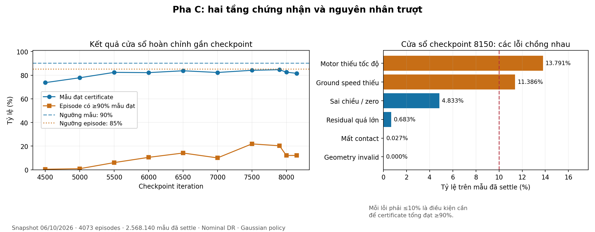

**Kiểm toán chỉ số đánh giá và độ khó pha C — Flat-VQR-Wheel-Yaw-POS-Skill**

Snapshot đọc lúc **06/10/2026 09:38:58 +07:00**. Code được đối chiếu ở commit `1507d2e9035afd00ed8133a439a21f0e6cdeaf71`. Run: `2026-10-06_00-48-36_settle_normalized_residual`; checkpoint khảo sát: **8150**, lưu lúc **09:32:41**. Các số chính dưới đây lấy từ **cửa sổ hoàn chỉnh `infos.yaw_pos_skill_curriculum.values.last`**, không lấy trung bình các điểm TensorBoard của cửa sổ đang thu.

Nguồn số liệu: [snapshot và phép tính](data/yaw_pos_skill_phase_c_2026-10-06.json). Run tiếp tục thay đổi sau snapshot này.

**1. Ba tầng đánh giá cần phân biệt**

Một mẫu là một lần reward được tính ở **50 Hz**, sau bốn bước physics; không phải mọi bước physics 200 Hz. `active` khi command `c > 0.1 rad/s`; `neutral` khi `|c| <= 0.1`. Sampler tạo neutral bằng 0 hoặc command dương trong `(0.1, 0.25]`, resample mỗi 4–6 giây ở pha C.

Một episode từ pha B trở đi được đưa vào mẫu số episode khi có ít nhất một mẫu active yaw. Không có yêu cầu tối thiểu về số mẫu đã settle trong episode: episode có active nhưng không có mẫu differential đã settle sẽ có differential score NaN và trượt gate đó.

Một cửa sổ gồm các episode đã kết thúc, có ít nhất **2048 eligible episodes**. Cả batch reset được ghi rồi mới evaluate nên cửa sổ có thể lớn hơn 2048; snapshot này có **4073** episode. Cửa sổ được xóa sau mỗi lần evaluate, các cửa sổ rời nhau.

Nguồn: [thu episode](../source/rl_training/rl_training/tasks/manager_based/locomotion/velocity/mdp/yaw_pos_skill_curriculums.py#L69), [ghi và đánh giá cửa sổ](../source/rl_training/rl_training/tasks/manager_based/locomotion/velocity/mdp/yaw_pos_skill_state.py#L99).

**2. Các score cấp episode và gate tương ứng**

Ở bảng dưới, `mean_active` là trung bình trên mẫu active của một episode. Log `metric/*_score` sau đó trung bình các score episode với trọng số episode bằng nhau; khác với tỷ lệ mẫu gộp toàn cửa sổ.

| Chỉ số | Định nghĩa một episode | Điều kiện episode đạt ở C |
|---|---|---|
| `support_score` | `mean_active[FL contact AND HR contact]`. Contact là norm của vector lực sensor **>1 N**, không riêng thành phần lực pháp tuyến. | >=0.85 |
| `lift_score` | `mean_active[min(progress_FR, progress_HL) * both_support_contact]`; `progress = clip((wheel_z-ground_z-0.091)/0.05, 0, 1)`. | >=0.80 |
| `balance_score` | Trung bình **toàn episode** của `exp(-(roll_error²+pitch_error²)/0.25²)`, nominal roll/pitch đều 0. Code lấy episode reward balance rồi chia weight và thời lượng thực episode. | >=0.75 |
| `height_score` | Chiều cao root thấp nhất trong **toàn episode**, tương đối ground, đơn vị m. Log là trung bình các minimum của episode; không phải minimum của cả cửa sổ. | >=0.35 m |
| `safe` | 1 khi episode không có termination thuộc loại `terminated`; timeout không làm trượt. | =1 |
| `yaw_score` | `mean_active[support * (0.25+0.75*mean_lift_progress) * exp(-(heading_rate-c)²/0.20²) * heading_valid]`. Đây là score có gate tư thế, không phải tỷ lệ quay đúng. | >=0.65 |
| `differential_episode` | Tỷ lệ mẫu **active đã settle** đạt certificate của episode, gọi là `p_e`. | `p_e >=0.90` |

`heading_rate` là đạo hàm heading của body-X chiếu xuống mặt đất; có tính ảnh hưởng tilt. Nó không đồng nhất với angular velocity body-Z hoặc world-Z.

Đối với **mỗi gate cấp episode đang bật**, ít nhất **85% eligible episodes** phải đạt. Ngoài ra, `joint_episode_success` yêu cầu ít nhất **85% episode đồng thời đạt tất cả gate đang bật**. Các tỷ lệ gate riêng cao không bảo đảm tỷ lệ AND này cao.

Nguồn: [yaw và các accumulator](../source/rl_training/rl_training/tasks/manager_based/locomotion/velocity/mdp/yaw_pos_rewards.py#L487), [lift](../source/rl_training/rl_training/tasks/manager_based/locomotion/velocity/mdp/yaw_pos_rewards.py#L428), [balance](../source/rl_training/rl_training/tasks/manager_based/locomotion/velocity/mdp/rewards.py#L541), [height](../source/rl_training/rl_training/tasks/manager_based/locomotion/velocity/mdp/rewards.py#L255).

**3. Tracking tổng và tracking gần biên**

`tracking = 1 - sum_active(|heading_rate-c|) / sum_active(|c|)`.

Đây là **1 trừ sai số tuyệt đối tương đối gộp**, không phải phần trăm mẫu nằm trong tolerance. Có thể âm, không clamp. Ví dụ 0.70 nghĩa là tổng sai số tuyệt đối bằng 30% tổng command.

`edge_tracking` dùng cùng công thức nhưng chỉ trên command `c >=0.8*yaw_limit`. Tại C, edge là **c >=0.20 rad/s**. Tracking tổng cần >=0.30, edge cần >=0.20, và phải có mẫu hợp lệ trong cửa sổ.

Các gate này khá rộng ở yaw thấp. Nếu robot quay cố định 0.175 rad/s và command uniform 0.10–0.25, tracking tổng kỳ vọng là khoảng **0.786**, dù robot không bám sự thay đổi command. Ví dụ này là phép tính lý thuyết, không mô tả trajectory của run.

**4. Certificate lăn vi sai: chính xác đang chứng nhận điều gì?**

Với mỗi bánh `i` thuộc FL/HR:

- `a_i`: trục bánh local +Y biến đổi sang world.
- `t_i = normalize(a_i × ground_normal)`: hướng lăn nằm ngang, không phụ thuộc pha quay của bánh.
- `v_target_i = [c * (z_hat × (wheel_position_i - whole_body_CoM))] dot t_i`, đơn vị m/s.
- `v_measured_i = wheel_link_center_velocity_world dot t_i`, đơn vị m/s. Đây là vận tốc tâm bánh trong world; không trừ vận tốc CoM.
- `motor_fraction_i = 0.091 * |joint_qdot_i| / max(|v_target_i|, 1e-4)`.
- `residual_i = v_measured_i - 0.091 * (wheel_body_angular_velocity_world dot a_i)`, đơn vị m/s. Angular velocity rigid body bao gồm spin bánh **và chuyển động chân mang bánh**; khác với joint qdot dùng trong motor fraction.
- `tolerance_i = max(0.25*|v_target_i|, 0.05 m/s)`.

Một mẫu pass chỉ khi **cả hai bánh, đồng thời**, đạt cả sáu điều kiện:

| Điều kiện | Công thức |
|---|---|
| Geometry hợp lệ | Hướng lăn và heading xác định, số hữu hạn, `|target| >1e-4 m/s` |
| Contact | Lực contact norm >1 N |
| Đúng chiều | `measured*target >0` |
| Đủ tốc độ lăn | `|measured| >=0.5*|target|` |
| Motor hoạt động đủ | `motor_fraction >=0.5` |
| Residual đủ nhỏ | `|residual| <=tolerance` |

Chỉ chấm certificate sau **0.5 s active kể từ lần đổi command gần nhất** hoặc reset. Timer được reset cả khi command dương đổi sang một command dương khác. Các mẫu trước settle không tính pass hoặc fail của certificate.

Certificate **không có giới hạn trên cho measured/target**, không có điều kiện trực tiếp `|measured-target| <= tolerance`, không kiểm tra dấu motor qdot, và không trực tiếp giới hạn vận tốc CoM. Ví dụ measured/target=2 vẫn có thể pass nếu các điều kiện khác đạt. Vì vậy nên đọc nó là chứng nhận **đúng chiều + hoạt động motor tối thiểu + contact + rolling residual**, không diễn giải là bám chính xác tốc độ hai bánh hoặc bằng chứng motor bánh cung cấp toàn bộ công quay.

Nguồn: [certificate](../source/rl_training/rl_training/tasks/manager_based/locomotion/velocity/mdp/yaw_pos_rewards.py#L90), [target và measured](../source/rl_training/rl_training/tasks/manager_based/locomotion/velocity/mdp/yaw_pos_kinematics.py#L35), [rolling residual](../source/rl_training/rl_training/tasks/manager_based/locomotion/velocity/mdp/wheel_contact_kinematics.py#L17).

**5. Mẫu số của các metric differential**

| Metric | Tử số / mẫu số; đơn vị |
|---|---|
| `metric/differential` | Tổng mẫu pass / tổng mẫu active đã settle của các episode hoàn thành; [0,1], weighted theo số mẫu |
| `gate_pass_rate/differential_episode` | Số eligible episode có `p_e >=0.90` / số eligible episode; [0,1], mỗi episode cùng trọng số |
| `differential_fail_*` | Số mẫu đã settle có **ít nhất một bánh** trượt điều kiện tương ứng / tổng mẫu đã settle; [0,1]. Các lỗi chồng nhau. |
| `differential_fl_signed_ratio`, `...hr...` | Trung bình `measured/target` trên **mọi mẫu active**, gồm trước settle; target gần 0 được fallback 0. Không clamp. Mean có thể bị chi phối bởi target nhỏ. |
| `differential_any_wrong_sign_pct` | `100 * mean_active[ít nhất một bánh có measured*target <0 và geometry hợp lệ]`; đã là %. Khác `fail_sign`: mẫu số khác, và velocity bằng 0 chỉ làm `fail_sign` trượt. |
| `differential_settled` | Số mẫu đã settle / tổng mẫu active; đo coverage thời gian chấm, không phải tỷ lệ pass |
| `differential_legacy` | Certificate với timer cũ trên cùng trajectory; timer cũ không reset khi positive command đổi sang positive command khác |
| `differential_legacy_settled` | Coverage chấm theo timer cũ / tổng mẫu active |
| `active_command_change` | Số lần phát hiện đổi command khi active / tổng mẫu active; tỷ lệ theo step, không phải % lần resample |
| `differential_fixed_episode`, `...legacy_episode` | So sánh episode pass của hai certificate trên **cùng tập episode có mẫu settle ở cả hai cách**; mẫu số khác eligible episodes của curriculum |

`rolling_tracking` là reward liên tục riêng: `1 / (1 + max_i[((measured_i-target_i)/tolerance_i)²])`, nhân gate geometry/contact và active. Motor fraction không xuất hiện trong công thức reward này.

Residual penalty mới dùng `excess=max(|residual|/tolerance-1,0)`, Huber theo excess, lấy bánh đỡ có cost lớn hơn; weight -0.5. Nó vẫn nhân hệ số command relief `max(0,1-|c|/1.0)`, tương ứng khoảng 0.75–0.90 ở C. Nhánh active không phạt trong tolerance. Nhánh neutral giữ raw rolling penalty. Đây là reward shaping, không thay threshold certificate.

**6. Neutral và reward tổng: những cách đọc dễ nhầm**

Các chỉ số sau được thu ở C nhưng **không tham gia chuyển C → D**:

| Metric | Định nghĩa |
|---|---|
| `neutral` | Mẫu neutral **đã có anchor** đồng thời có bốn contact, root world-XY speed <=0.03 m/s và drift <=0.05 m / tổng mẫu neutral đã có anchor |
| `four_contact` | Mẫu neutral có đủ bốn contact / mọi mẫu neutral |
| `anchor_coverage` | Mẫu neutral đã có anchor / mọi mẫu neutral |
| `neutral_position_drift` | Trung bình khoảng cách root-XY tới anchor cố định, chỉ trên mẫu đã có anchor; m |
| `neutral_planar_speed` | Trung bình norm root **body-frame XY** velocity trên mọi mẫu neutral; m/s. Certificate neutral dùng root **world-frame XY**, nên hai đại lượng không hoàn toàn đồng nhất khi tilt. |

Anchor được latch sau **0.2 s contact liên tục của cả bốn bánh**. Acquisition không yêu cầu speed <=0.03; speed đó là điều kiện hold pass. Khi mất contact, anchor không được dời để xóa drift; khi quay lại active hoặc reset thì anchor được giải phóng.

`Train/mean_reward` là trung bình tổng reward episode của buffer **100 episode kết thúc gần nhất** trong RSL-RL. Reward mỗi step là `sum(weight * raw_term * step_dt)`. Đây không phải tỷ lệ đạt kỹ năng.

`Episode_Reward/<term>` lấy episode reward có trọng số rồi chia **thời lượng episode tối đa 20 s**, không chia thời lượng thực của từng episode. Với episode chết sớm, không được gọi đây là raw score trung bình theo thời gian thực. `balance_score` của curriculum có phép chuẩn hóa thời lượng thực riêng như bảng trên.

Nguồn: [neutral hold](../source/rl_training/rl_training/tasks/manager_based/locomotion/velocity/mdp/yaw_pos_rewards.py#L205), [anchor coverage](../source/rl_training/rl_training/tasks/manager_based/locomotion/velocity/mdp/yaw_pos_skill_rewards.py#L9), installed `rsl_rl/runners/on_policy_runner.py` và `isaaclab/managers/reward_manager.py`.

**7. Những vấn đề trong cách log hiện tại**

- `Curriculum/skill/metric/*` và `gate_pass_rate/*` dùng cửa sổ đang thu nếu nó có episode; nếu rỗng thì dùng cửa sổ hoàn chỉnh vừa đánh giá. Mean của 100 điểm log có thể trộn cửa sổ lớn, cửa sổ rất nhỏ và giá trị lặp. Nó không phải 100 lần đánh giá độc lập.
- `blocker/*` dùng kết quả evaluate gần nhất; có thể khác metric của partial window đang được log.
- `gate_threshold/differential_episode=0.90` là threshold **bên trong episode**. Đường `gate_pass_rate/differential_episode` phải so với **0.85**, không phải 0.90.
- `gate_pass_rate/yaw` cũng phải so với 0.85; `gate_threshold/yaw=0.65` chỉ dành cho score của từng episode.
- `gate_pass_rate/tracking` thực ra là tracking ratio liên tục, không phải tỷ lệ episode. Nhóm `gate_pass_rate` đang chứa hai loại đại lượng.
- Khi báo cáo kết quả chứng nhận, ưu tiên checkpoint `state.last`, hoặc event của cửa sổ hoàn chỉnh và loại các điểm lặp. Nhóm `Curriculum/task_levels/skill/last_window/*` phản ánh kết quả evaluate nhưng vẫn có thể được log lặp qua nhiều update.

Nguồn: [hook logging](../scripts/reinforcement_learning/rsl_rl/yaw_pos_skill_training.py#L158).

**8. Khảo sát định lượng độ khó C bằng cửa sổ hoàn chỉnh**

Snapshot 8150 có **2,568,140 mẫu đã settle** trong **4073 eligible episodes**, trung bình khoảng **630.5 mẫu/episode**, tương đương 12.6 s được chấm. Stage đã chạy **156646 environment steps**, vượt xa minimum 6000. Streak vẫn 0.

| Gate/chỉ số | Kết quả | Điều kiện chuyển pha |
|---|---:|---:|
| Episode đạt support | 99.902% | >=85% |
| Episode đạt lift | 99.804% | >=85% |
| Episode đạt balance / height / safe | 100% mỗi gate | >=85% mỗi gate |
| Episode đạt yaw | 99.779% | >=85% |
| Tracking tổng | 0.6976 | >=0.30 |
| Edge tracking | 0.7717 | >=0.20 |
| Differential mẫu | **81.547%** | **>=90%** |
| Episode đạt differential | **12.080% = 492/4073** | **>=85%, ít nhất 3463/4073** |
| Joint episode success | **12.080%** | **>=85%** |

Thêm yêu cầu **3 cửa sổ liên tiếp** đạt mọi điều kiện. C giữ clearance 5 cm, yaw limit 0.25, robustness 0; đây là độ khó ở điều kiện nominal và policy lấy mẫu Gaussian trong training.

| Lỗi trên mẫu đã settle | Tỷ lệ | Số mẫu | Tỷ lệ trong toàn bộ mẫu trượt |
|---|---:|---:|---:|
| Motor thiếu tốc độ | **13.791%** | 354173 | 74.74% |
| Ground speed thiếu | **11.386%** | 292397 | 61.70% |
| Sai chiều hoặc zero measured | 4.833% | 124118 | 26.19% |
| Residual vượt tolerance | 0.683% | 17537 | 3.70% |
| Mất contact | 0.027% | 705 | 0.15% |
| Geometry invalid | 0% | 0 | 0% |

Những cột tỷ lệ lỗi không cộng lại được. Tổng mẫu trượt là **18.453%**. Riêng motor gate đã giới hạn tỷ lệ certificate tối đa trên trajectory này ở **86.209%**, ngay cả nếu mọi điều kiện khác pass. Riêng ground-speed gate giới hạn ở **88.614%**. Do đó **cả hai nhóm tốc độ đều phải cải thiện** để đạt window 90%.

Nếu giữ nguyên các điều kiện khác trên cùng trajectory và sửa được mọi lỗi residual, cải thiện tối đa chỉ **0.683 điểm phần trăm**, tới **82.230%**; lỗi residual-only có thể ít hơn do chồng lỗi. Đây là bound hồi cứu trên trajectory cố định, không phải dự báo tác động của reward lên trajectory tương lai.

Hai nhóm motor/ground speed có ít nhất **6.724% tổng mẫu** cùng trượt, suy ra từ `f_motor + f_ground - total_failure`. Log hiện chưa đủ để xác định lỗi riêng FL/HR hoặc số mẫu chỉ trượt một điều kiện.

Các điểm trên hình là kết quả của cửa sổ hoàn chỉnh gần checkpoint tương ứng, không phải trung bình 500 update. Sau checkpoint 5500, differential mẫu chủ yếu dao động khoảng **81.5–84.6%** ở những snapshot đã khảo sát. Episode đạt có cải thiện nhưng dao động **6–22%**, còn xa 85%; chưa có cửa sổ được chọn nào tạo streak pass.

**9. Vì sao hai tầng 90% và 85% tạo độ khó lớn?**

Với một episode có khoảng 630 mẫu được chấm, đạt certificate nghĩa là được trượt tối đa khoảng **63 mẫu**, tương đương **1.26 s**. Sau đó ít nhất 85% episode phải đạt mức ấy. Window mean cao không chứng minh điều kiện theo episode.

Minh họa toán học, giả sử 630 mẫu độc lập và có cùng xác suất pass `p`: nếu `p=90%`, xác suất episode đạt >=90% chỉ khoảng **53.35%**. `p=91%` cho khoảng **82.87%**; cần `p≈91.10%` mới cho kỳ vọng 85% episode đạt. Đây không phải mô hình fit của run: các mẫu thực có tương quan thời gian và các episode có độ khó khác nhau. Số thực 81.55% mẫu / 12.08% episode cũng cho thấy không thể dùng giả định i.i.d. này để dự báo run.

**10. Độ khó vật lý, độ khó do exploration và khoảng cách reward–certificate**

Ở C, tolerance residual có floor 0.05 m/s; nhánh 25% chỉ lớn hơn floor khi `|target| >0.20 m/s`. Command yaw thấp không có nghĩa relative motor-speed gate dễ hơn, vì tốc độ target cũng nhỏ.

Ví dụ minh họa effective lever arm **0.30 m**, không phải số đo geometry của run:

| Command rad/s | Target m/s | Motor qdot tối thiểu rad/s | Tolerance m/s | Tolerance / target |
|---|---:|---:|---:|---:|
| 0.10, sát deadband | 0.0300 | 0.1648 | 0.05 | 167% |
| 0.175 | 0.0525 | 0.2885 | 0.05 | 95% |
| 0.25 | 0.0750 | 0.4121 | 0.05 | 67% |

Điều này giải thích vì sao residual có thể dễ pass trong khi các điều kiện tốc độ vẫn khó. `relative_std=0.25` không đồng nghĩa luôn đòi residual <=25% target ở C.

Checkpoint 8150 có action std FL/HR **0.13260 / 0.12580**. Với scale action bánh 5, std của **velocity target** là **0.663 / 0.629 rad/s**, tương đương radius-times-target-noise **0.0603 / 0.0572 m/s**. Wheel-velocity observation noise vẫn **±0.5 rad/s** ở nominal. Đây là quy mô nhiễu của action target và observation; không phải độ lệch chuẩn motor velocity thực, vốn chịu PD, inertia và delay. Chưa có rollout deterministic của checkpoint Skill này để kết luận exploration gây trượt bao nhiêu.

Reward `rolling_tracking` không trực tiếp dùng motor fraction. Nếu measured=target và residual trong tolerance, score rolling có thể cao dù motor fraction chỉ 0.49 và certificate trượt. `signed_ground_participation` dùng ground velocity, cũng không trực tiếp chứng nhận công motor. Low residual đo total wheel-body rotation, còn motor gate đo relative joint rotation. Vì vậy cần khảo sát riêng qdot và angular velocity của chân mang bánh; không được suy ra motor đủ hoạt động chỉ từ residual nhỏ.

FL/HR signed ground ratios của cửa sổ này là **2.075 / 1.687**, nhưng đây là mean trên mọi active sample và không phải tỷ lệ motor. Cần median/quantile, target magnitude và phân nhóm command để kết luận overspeed; mean ratio riêng không đủ. Certificate hiện vẫn có thể pass overspeed như đã định nghĩa ở mục 4.

**11. Một sai lệch số học đã tái hiện**

`_values()` chia counter bằng tensor float32, rồi `.cpu().tolist()` chuyển score sang Python float. `SkillState.record()` so với threshold Python 0.90. Ví dụ **9/10** thành `0.8999999761581421`: so sánh trong Torch với 0.90 cho True, nhưng so sánh Python cho False. Actual `SkillState.record()` ghi episode này là fail.

Metric paired `differential_fixed_episode` so trong Torch nên có thể pass đúng biên này, còn curriculum gate trượt. Khác biệt mẫu số cũng làm hai metric không bằng nhau. Đây là lỗi biên cần sửa bằng so counter số nguyên hoặc phép so có tolerance hợp lý. Nó không giải thích khoảng cách **12.08% →85%** hiện tại. Chưa thay code trong lần kiểm toán này.

**12. Dữ liệu cần thêm để khảo sát threshold C chính xác**

Aggregate checkpoint đủ xác định các blocker và bound ở trên, nhưng không chứa histogram `p_e`, distribution motor fraction từng bánh, hay tổ hợp điều kiện trượt từng mẫu. Không thể tính chính xác số episode sẽ đạt nếu đổi threshold certificate 0.90→0.85, hoặc minimum-speed fraction 0.50→0.40, chỉ từ aggregate đang có.

Ưu tiên một audit của cùng checkpoint với deterministic và sampled actions, xuất cho từng đoạn command: số mẫu settled, `p_e`, motor/ground fraction FL và HR, normalized residual, target magnitude, heading error, CoM speed và tổ hợp fail. Sau đó replay cùng dữ liệu để khảo sát threshold và settle-time; giữ riêng phép chứng nhận cuối với ngưỡng 90%.

Một lưu ý về công cụ sẵn có: `analyze_yaw_pos_certificate.py` đang tái dựng timer legacy không reset khi positive command đổi sang positive command khác, và công thức reward đối chiếu trong đó là shaping cũ có motor cost. Không dùng nguyên trạng script này để xác nhận trace training Skill mới; cần đồng bộ timer và reward trước. Với trace một đoạn positive cố định, vấn đề timer positive→positive không phát sinh. Các audit CSV hiện có thuộc checkpoint POS cũ ngày 02/10, không phải Skill checkpoint 8150.

Nhận định từ dữ liệu hiện có: **C khó ở tính ổn định của motor và ground speed qua phần lớn thời gian của phần lớn episode. Contact, pose, yaw và residual đã tương đối tốt.** Ưu tiên làm rõ reward–motor gate và exploration trước khi cân nhắc thay ngưỡng; chưa có dữ liệu để coi threshold 90% là không thể đạt.
