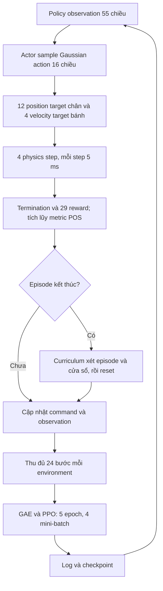

# Phân tích luồng training Flat-VQR-Wheel-Yaw-POS hiện tại

Thời điểm chốt snapshot metric: **05/10/2026, 13:48:55 +07:00**. Source ở commit `987e856`, cộng thay đổi local chưa commit trong `velocity_yaw_env_cfg.py`. Run mới nhất được phân tích là `2026-10-05_10-43-00`, với metric đến iteration **631**. Các log có thể tiếp tục thay đổi sau thời điểm này.

Đã đối chiếu source, `params/env.yaml`, `params/agent.yaml`, checkpoint và TensorBoard của ba run. Tài liệu tách kết luận có bằng chứng khỏi giả thuyết về nguyên nhân học chưa đạt. Không thay đổi source hay khởi chạy thêm training để thực hiện phân tích này.

## 1. Những kết luận chính

1. **Bản source trên đĩa có tên observation chưa đồng bộ.** Critic nền vừa đổi `rolling_lateral_contact_velocity` thành `contact_velocity`, nhưng `VQRWheelFlatEnvPOSCfg.__post_init__` vẫn truy cập tên cũ. Theo cấu trúc config hiện tại, đường khởi tạo config POS sẽ truy cập thuộc tính không tồn tại.
2. **Run mới nhất là train mới, không phải resume từ `model_36999.pt`.** YAML lưu `resume=False`; TensorBoard bắt đầu iteration 0, std ban đầu gần 1; checkpoint hiện có iteration 500. Trường `load_checkpoint` có đường dẫn không tự kích hoạt nạp model.
3. **Run mới đã học được nhiều phần của tư thế đỡ/nâng bánh, nhưng chưa đạt hành vi quay và đứng yên.** Reward tăng lên trên 300 và episode gần đủ 20 giây, trong khi curriculum vẫn ở clearance/yaw stage 0, window success rate bằng 0.
4. **Checkpoint cũ quay theo heading tốt hơn, nhưng vẫn không đạt chứng nhận vi sai và neutral holding.** Cuối run cũ có tracking ratio khoảng 0.78, song differential certification khoảng 14% và neutral-hold khoảng 23%, thấp hơn mức 90% yêu cầu.
5. **Các gate trong curriculum áp dụng ngay từ clearance stage đầu.** Tên “nâng bánh trước” không có nghĩa stage đầu bỏ qua yaw, vi sai hoặc neutral holding. Điều này giải thích vì sao học được pose chưa đủ để lên clearance stage tiếp theo.

## 2. Source hiện tại và cấu hình đã nạp vào run là hai trạng thái khác nhau

Thay đổi local hiện tại:

```diff
--- velocity_yaw_env_cfg.py
-        rolling_lateral_contact_velocity = ObsTerm(...)
+        contact_velocity = ObsTerm(...)
```

Trong khi config POS vẫn có:

```python
self.observations.critic.rolling_lateral_contact_velocity.func = (
    wheel_contact_kinematics.rolling_lateral_contact_velocity
)
```

Đã kiểm tra bằng AST: `ObservationsCfg.CriticCfg` hiện có field `contact_velocity`, không có field `rolling_lateral_contact_velocity`; method POS có một truy cập tên cũ tại dòng 200.

**Hệ quả theo source:** tạo mới config POS sẽ gặp lỗi truy cập thuộc tính, trước khi đến vòng cập nhật PPO. Đây là kết luận từ cấu trúc mã; chưa mở Isaac Sim để thu exception runtime.

File nền có mtime `05/10/2026 11:21:42 +07:00`, sau thời điểm khởi tạo run `10-43-00`. YAML của run vẫn có term tên cũ, với callable POS đúng trong `wheel_contact_kinematics.py`. Vì vậy không dùng thay đổi tên trên đĩa để giải thích các metric của model đã được khởi tạo từ config trước đó.

Khi đồng bộ lại tên field, cần xét thêm observation contract: checkpoint hiện có actor input 55 và critic input 83; adaptation loader còn so sánh tên/thứ tự observation term. Chỉ giữ nguyên kích thước tensor chưa đủ để qua mọi kiểm tra contract.

Nguồn: [field critic hiện tại](../source/rl_training/rl_training/tasks/manager_based/locomotion/velocity/velocity_yaw_env_cfg.py#L305), [truy cập trong POS](../source/rl_training/rl_training/tasks/manager_based/locomotion/velocity/config/wheeled/vqr_wheel/yaw_env_pos_cfg.py#L193), [adaptation contract](../scripts/reinforcement_learning/rsl_rl/yaw_pos_adaptation.py#L24).

## 3. Luồng thực tế của run mới nhất

### 3.1. Khởi tạo

`params/agent.yaml` của `2026-10-05_10-43-00` lưu:

| Trường | Giá trị |
| --- | --- |
| `resume` | `False` |
| `max_iterations` | `1000` |
| `save_interval` | `500` |
| `seed` | `42` |
| `device` | `cuda:0` |
| `load_checkpoint` | `~/tuanpm48/vqr/rl_training/logs/rsl_rl/vqr_wheel_yaw_flat_pos/2026-10-02_15-05-31/model_36999.pt` |

`params/env.yaml` lưu `num_envs=4096`, command range `(0,0.25)`, neutral probability `0.30`, deadband `0.1`, resampling `(4,6) s`, `use_ground_heading_rate=True`.

Trong `train.py`, nhánh nạp checkpoint chạy khi:

```python
if agent_cfg.resume or agent_cfg.algorithm.class_name == "Distillation":
    checkpoint_infos = runner.load(resume_path, load_optimizer=True)
```

Run này dùng PPO và `resume=False`. Metric bắt đầu tại iteration 0, `Policy/mean_noise_std` ban đầu khoảng `0.997`, rồi có `model_500.pt` chứa iteration 500. Các bằng chứng này nhất quán với việc học mới.

Nếu mục đích của lệnh chạy là tiếp tục checkpoint 36999 thì mục đích đó chưa được thực hiện bởi nhánh train thông thường. Nếu chủ ý học mới, cấu hình này đúng với chủ ý đó. Đường dẫn checkpoint có `~` được lưu trong YAML cũng chưa được nhánh resume kiểm tra hay mở trong run này.

Nguồn: [nạp checkpoint](../scripts/reinforcement_learning/rsl_rl/train.py#L681), [resume và curriculum](../scripts/reinforcement_learning/rsl_rl/train.py#L720).

### 3.2. Vòng học



Mỗi iteration có `4096*24=98,304` transition. Actor output Gaussian action được scale thành position residual chân `0.30/0.60/0.50` và velocity target bánh `5.0`. Physics chạy 200 Hz, policy chạy 50 Hz.

Actor dùng mạng `55 → 512 → 256 → 128 → 16`; critic dùng `83 → 512 → 256 → 128 → 1`, activation ELU. Shape này được xác nhận từ tensor `actor.0.weight` và `critic.0.weight` trong cả ba checkpoint đã đọc.

Command active chỉ dương, cặp đỡ cố định `FL/HR`; neutral yêu cầu đứng bốn bánh. Policy phải tự học chuyển tư thế. Curriculum cập nhật ở reset episode, không ở cuối mỗi PPO update.

## 4. Run mới đang học được gì và chưa học được gì?

Các giá trị trung bình dưới đây là **trung bình 100 điểm scalar TensorBoard cuối**, đến iteration 631. Chúng không phải tỷ lệ thành công của một episode riêng, không phải trung bình có trọng số trên toàn bộ physics sample và không phải 100 cửa sổ curriculum độc lập. Metric cửa sổ có thể được log lặp lại giữa hai lần đánh giá.

| Metric | Run mới, iteration 532–631 | Điều kiện liên quan |
| --- | ---: | --- |
| Mean episode reward | `315.56` | Không dùng trực tiếp làm gate progression |
| Mean episode length | `995.63` bước, khoảng `19.91 s` | Episode tối đa 1000 bước |
| Support score | `0.9268` | Episode gate `>=0.85` |
| Lift minimum progress | `0.8408` | Episode gate `>=0.80` |
| Balance score | `0.9364` | Episode gate `>=0.75` |
| Active gated yaw score | `0.4579` | Episode gate `>=0.65` |
| Window tracking ratio | `-0.2796` | Khi lên yaw stage: stage 0 yêu cầu `>=0.30` |
| Differential certification rate | `0.2641` | Cửa sổ cần `>=0.90`; episode còn có gate riêng |
| Neutral-hold certification rate | `0.0354` | Cửa sổ cần `>=0.90` |
| Neutral four-contact rate | `0.3708` | Holding cần cả bốn bánh contact |
| Neutral planar speed | `0.0799 m/s` | Holding sample cần `<=0.03 m/s` |
| Active CoM planar speed | `0.1370 m/s` | Reward stationary có scale `0.05 m/s` |
| Có bánh đỡ rolling sai dấu | `60.37%` | Differential pass yêu cầu cả hai đúng dấu |
| Fail reason yaw | `1.0` | Các batch episode được đánh giá đều trượt yaw gate |
| Window success rate | `0.0` | Cần `>=0.85` |

Ở điểm scalar cuối iteration 631, differential window rate là `0.2741`, neutral-hold là `0.0525`; clearance/yaw stage đều 0, yaw limit `0.25 rad/s`.

**Diễn giải:** policy đã cải thiện khả năng giữ robot sống, cân bằng và đạt tiến độ nâng bánh nhỏ. Nó chưa quay đúng mục tiêu đủ ổn định, còn dịch chuyển trong POS và chưa đứng bốn bánh đủ ổn định trong neutral. Hai certification gate còn cách rất xa threshold.

Mean support/lift/balance cao hơn threshold không chứng minh từng episode đạt: gate dùng từng episode và yêu cầu nhiều điều kiện đồng thời. `window_success_rate=0` là bằng chứng trực tiếp rằng chưa có tiến độ thành công theo định nghĩa curriculum.

Khoảng `99.0%` termination trong 100 scalar cuối là timeout; mean value loss khoảng `0.237`. Checkpoint 500 có toàn bộ tensor model hữu hạn. Không thấy bằng chứng divergence số học trong các dữ liệu đã kiểm tra. Điều này không loại trừ vấn đề tối ưu hóa hành vi hoặc reward.

Snapshot hiện có log đến 631 và checkpoint định kỳ 500, chưa phải bằng chứng đã hoàn thành kế hoạch 1000 update. Không xác định trạng thái tiến trình chỉ từ tên thư mục hoặc checkpoint gần nhất.

## 5. Vì sao reward trên 300 mà curriculum vẫn stage 0?

### 5.1. Reward tổng có nhiều nguồn điểm

PPO tối ưu tổng có trọng số của mọi reward; nó không trực tiếp tối ưu `window_success_rate`. Một policy giữ balance/base height tốt, sống đủ 20 giây, nâng bánh một phần và nhận điểm neutral vẫn có thể có return cao khi yaw/vi sai chưa đạt.

Ví dụ 100 scalar reward cuối của lần đọc đến iteration 624:

| Episode reward rate | Trung bình |
| --- | ---: |
| `balance` | `1.865` |
| `base_height` | `1.651` |
| `lift_clearance` | `1.779` |
| `gated_yaw_tracking`, gồm cả nhánh neutral | `4.166` |
| `rolling_tracking` | `0.0823` |
| `active_com_stationary` | `0.464` |
| `neutral_position` | `0.0252` |

Các số này là episode reward rate được logger ghi, không phải raw term. Chúng cho thấy contribution rolling tracking và neutral position đang nhỏ so với các nguồn điểm khác. Không được dùng riêng `gated_yaw_tracking` episode reward để suy ra chất lượng quay POS, vì term còn thưởng giữ yaw bằng 0 trong neutral.

### 5.2. “Lift first” vẫn có đầy đủ gate hành vi

Ở clearance stage 0, episode success đã đòi support, lift, balance, yaw, minimum height, không torso termination và differential behavior. Cửa sổ còn đòi cả differential và neutral-hold rate >=90%.

Chỉ hai **tracking ratio gate tổng/edge** được thêm khi clearance đã hoàn tất; yaw-score gate và behavior certification không được hoãn đến giai đoạn đó.

**Hệ quả chắc chắn từ logic:** chỉ học nâng 5 cm chưa đủ để lên 10 cm. Policy phải đồng thời đáp ứng những kỹ năng khác ngay ở stage đầu.

**Nhận định thiết kế:** cấu hình này chặt chẽ trong việc chứng nhận hành vi cuối, nhưng ít phân chia độ khó giữa các kỹ năng khi học từ đầu. Dữ liệu hiện tại phù hợp với một nút thắt ở yaw/vi sai/neutral, chưa đủ để chứng minh rằng các threshold không thể đạt.

Nguồn: [episode success](../source/rl_training/rl_training/tasks/manager_based/locomotion/velocity/mdp/curriculums.py#L390), [gate cửa sổ](../source/rl_training/rl_training/tasks/manager_based/locomotion/velocity/mdp/curriculums.py#L511), [POS certification](../source/rl_training/rl_training/tasks/manager_based/locomotion/velocity/mdp/yaw_pos_curriculums.py#L62).

## 6. Checkpoint cũ và thử nghiệm resume cho thấy gì?

| Chỉ tiêu | Run `2026-10-02_15-05-31` | Resume `2026-10-05_08-57-12_...` |
| --- | --- | --- |
| Phạm vi iteration có log | `27000–36999` | `36999–37028`, 30 điểm scalar |
| Clearance stage | `3`, target `0.20 m` | `3` |
| Yaw stage | `5`, limit `1.0 rad/s` | `5` |
| Window tracking ratio cuối | `0.7802` | `0.7454` |
| Edge tracking ratio cuối | `0.8551` | `0.8190` |
| Differential certification cuối | `0.1421` | `0.1483` |
| Neutral-hold certification cuối | `0.2255` | `0.1848` |
| Window success rate cuối | `0` | `0` |

Run cũ cuối cùng tracking heading tốt, nhưng các chứng nhận hành vi vẫn không đạt. Nó giữ yaw stage 5 trong toàn bộ 10000 điểm scalar đã đọc. Đây là bằng chứng rằng tăng số iteration đơn thuần trong điều kiện đó chưa giải quyết được các gate.

Run resume thực sự khác run mới 10-43-00: nó có `resume=True`, khởi đầu iteration 36999 và giữ stage 3/5. Trong checkpoint 37000, std support wheels khoảng `FL=0.1200`, `HR=0.1220`, phù hợp với override 0.12 sau một vài update. Các bánh `FR/HL` vẫn có std khoảng `0.412/0.449`.

Chưa có đủ dữ liệu của kế hoạch 1000 update trong snapshot resume để kết luận thử nghiệm 1k hoàn thành hoặc đánh giá xu hướng dài hạn.

Run cũ dùng reward `differential_rolling`; source/run mới có các term `signed_ground_participation`, `rolling_tracking`, `active_com_stationary`. Độ khó và objective khác nhau, nên bảng không phải đối chứng một biến và không dùng mean reward giữa hai run để xếp hạng trực tiếp chất lượng policy.

## 7. Những yếu tố có thể gây khó học

### 7.1. Action exploration ở bánh lớn so với lệnh yaw stage đầu

Trong `model_500.pt` của run mới:

```text
FL action std = 0.5146 → wheel velocity target std ≈ 2.573 rad/s
HR action std = 0.5437 → wheel velocity target std ≈ 2.719 rad/s
```

Đây là độ lệch chuẩn của **target trước actuator**, không phải đo đạc actual motor speed. Với `R=0.091 m`, tốc độ vành bánh tương đương có scale khoảng `0.23–0.25 m/s`.

Để thấy độ lớn tương đối: nếu khoảng cách từ CoM đến support wheel theo phương cần quay là `0.225 m`, yaw command `0.1–0.25 rad/s` chỉ cần ground speed cỡ `0.0225–0.0563 m/s`, hay motor speed cỡ `0.25–0.62 rad/s` trong giả định lăn lý tưởng. Geometry thực tế có thể khác giả định này.

**Giả thuyết:** exploration bánh góp phần làm khó tracking tốc độ nhỏ và neutral holding, phù hợp với tỷ lệ rolling sai dấu cao. Chưa có rollout đối chứng deterministic/stochastic cùng checkpoint để định lượng phần ảnh hưởng đó.

Giảm noise đo tốc độ bánh xuống `±0.5 rad/s` trong observation không làm giảm Gaussian action std. Đây là hai cơ chế khác nhau.

### 7.2. Actor không quan sát trực tiếp mục tiêu neutral position

Actor 55 chiều nhận angular velocity, gravity, command, relative joint positions/velocities và action. Nó không có term trực tiếp cho root/CoM planar velocity, contact mask hay drift so với neutral anchor; critic có nhiều dữ liệu vật lý bổ sung.

Anchor được chốt sau 0.2 giây bốn bánh contact, và reward phạt drift so với anchor đó. Actor có thể học đứng ổn định bằng proprioception, nhưng phản hồi sửa drift sau push/slip bị hạn chế vì không thấy trực tiếp sai số vị trí hay vận tốc tịnh tiến.

**Giả thuyết:** thiếu tín hiệu quan sát trực tiếp góp phần làm neutral-hold certification khó đạt. Privileged critic giúp ước lượng value, không tự cung cấp thêm input cho actor. Chưa thể kết luận cần thêm observation nếu chưa kiểm tra khả năng giữ yên của deterministic policy và các disturbance cụ thể.

### 7.3. Chứng nhận kinematics chưa chứng minh nguồn công cơ học

Differential gate hiện kiểm tra ground rolling đúng dấu, đủ tốc độ, motor joint speed đủ lớn và residual nhỏ. Nó không kiểm tra riêng công suất dương `tau_wheel*qd_wheel` hoặc tỷ lệ công do motor bánh cung cấp.

Vì vậy yaw/ground kinematics tốt chưa đủ để kết luận việc quay chủ yếu do motor bánh tạo ra. Nếu mục tiêu là xác nhận quay bằng bánh thay vì chuyển động chân, cần đọc đồng thời target, actual qd, applied torque/power, wheel-center velocity và motion của chân. Đây là giới hạn của bằng chứng hiện có, không phải kết luận policy đang khai thác một hành vi cụ thể.

### 7.4. Metric balance đầu run bị ảnh hưởng bởi episode-length randomization

`train.py` gọi `learn(init_at_random_ep_len=True)`. Runner random hóa `episode_length_buf` trước rollout, trong khi curriculum chuẩn hóa balance bằng:

```text
balance_score = episode_reward_sum / (episode_length_buf * step_dt * weight)
```

Trong episode đầu, bộ đếm có thể đã chứa nhiều bước giả định trước khi thực sự có reward. Khi timeout, mẫu số có thể tương ứng 20 giây, còn reward sum mới được tích lũy từ phần rollout sau khi khởi tạo. Điều này làm balance score đầu run thấp hơn score vật lý trung bình thực sự.

Với 24 bước/iteration, một episode đầy đủ là khoảng 41.7 iteration. Thử nghiệm resume chỉ có 30 điểm log, nên nhiều thống kê đầu run còn có thể bị ảnh hưởng bởi episode đầu đã random hóa. Không nên coi balance tụt ngay từ checkpoint tốt xuống gần 0 là bằng chứng policy mất kỹ năng ngay lập tức.

Hiệu ứng này không giải thích việc run mới vẫn trượt yaw/behavior sau hơn 600 iteration, và không giải thích plateau kéo dài 10000 iteration của run cũ.

Nguồn: [learn invocation](../scripts/reinforcement_learning/rsl_rl/train.py#L789), [chuẩn hóa episode score](../source/rl_training/rl_training/tasks/manager_based/locomotion/velocity/mdp/curriculums.py#L318). Đã đối chiếu thêm `rsl_rl/runners/on_policy_runner.py` trong môi trường Python local.

## 8. Thứ tự xử lý đề xuất dựa trên bằng chứng

1. **Đồng bộ tên observation critic trước lần khởi tạo mới.** Giữ tên/thứ tự term phù hợp với checkpoint và adaptation contract đã chọn.
2. **Chốt cách khởi tạo run.** Nếu tiếp tục 36999, dùng đường resume thực sự và kiểm tra `[PRESTART]`, starting iteration, stage, optimizer LR và action std. Nếu học mới, đánh giá bằng tiêu chí học mới ở stage 0.
3. **Tách đánh giá skill và exploration.** Cùng checkpoint, chạy sequence neutral → POS → neutral với action mean; sau đó thêm action sampling, observation noise và checkpoint DR từng yếu tố. Không thay reward hay gate cùng lúc trong đối chứng này.
4. **Phân rã failure vi sai.** Đo riêng đúng dấu, thiếu ground speed, motor thiếu tốc độ, mất contact và residual; hiện log wrong-sign khoảng 60% là tín hiệu ưu tiên kiểm tra.
5. **Phân rã neutral failure.** Tách landing/contact coverage, điều kiện có anchor, speed và drift. Neutral contact chỉ khoảng 37% và speed khoảng 0.08 m/s cho thấy chưa thể chỉ sửa phần position reward.
6. **Sau khi có đối chứng mới quyết định sửa curriculum/reward/observation.** Một hướng cần cân nhắc là chia thời điểm bật certification theo kỹ năng; giữ đầy đủ gate cuối để không đánh đồng pose tốt với quay vi sai/đứng yên đạt yêu cầu.

Những bước trên là đề xuất cho lần kiểm tra hoặc chỉnh sửa tiếp theo; phân tích này chưa thay source, threshold, std, checkpoint hay trạng thái training.

## 9. Nguồn dữ liệu có thể kiểm tra lại

Các file trong workspace:

```text
logs/rsl_rl/vqr_wheel_yaw_flat_pos/
  2026-10-05_10-43-00/
    params/env.yaml
    params/agent.yaml
    model_500.pt
    events.out.tfevents.1791171811.robotics-Precision-7920-Tower.1789895.0

  2026-10-05_08-57-12_pos_signed_stationary_std012_noise05_push015_1k/
    params/env.yaml
    params/agent.yaml
    model_37000.pt
    events.out.tfevents.1791165456.robotics-Precision-7920-Tower.1712344.0

  2026-10-02_15-05-31/
    params/env.yaml
    params/agent.yaml
    model_36999.pt
    events.out.tfevents.1790928345.robotics-Precision-7920-Tower.787397.0
```

Các checkpoint được đọc bằng `torch.load(..., map_location="cpu", weights_only=True)`. Scalar dùng TensorBoard `EventAccumulator`, lưu toàn bộ điểm scalar trong bộ nhớ rồi chốt chung cutoff iteration cho nhóm metric trong từng run. Log/checkpoint có thể không nằm trong Git và không tồn tại trên workspace khác.

Mô tả toàn bộ cấu hình ở thời điểm tài liệu trước được tạo: [Flat_VQR_Wheel_Yaw_POS_Flow_And_Config.md](Flat_VQR_Wheel_Yaw_POS_Flow_And_Config.md). Thay đổi local tên observation được phát hiện trong phân tích này xảy ra sau snapshot source của tài liệu đó.
